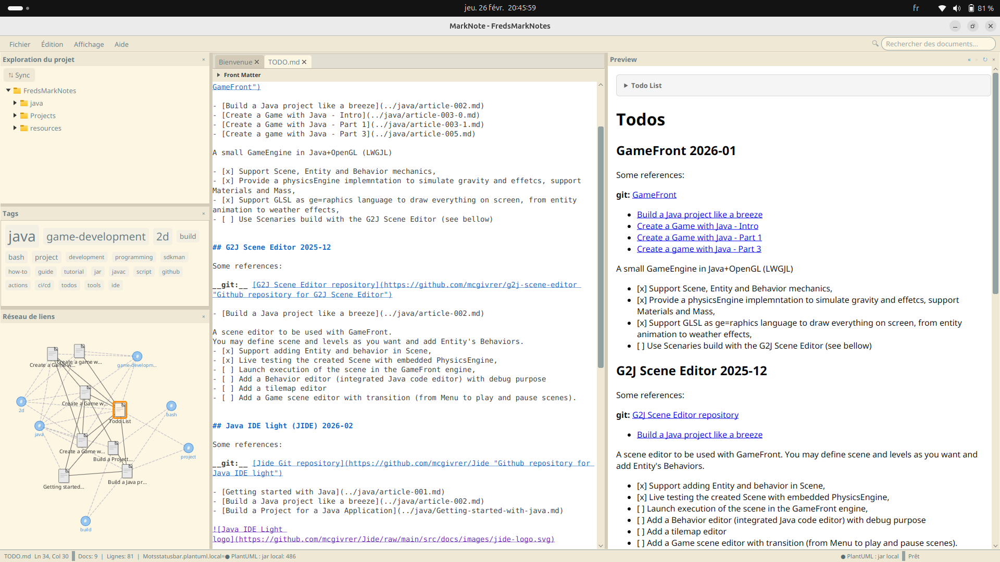

# MarkNote


[](https://github.com/mcgivrer/MarkNote/actions/workflows/java-build.yml)


A lightweight and modern Markdown editor built with JavaFX.



**Author:** Frédéric Delorme (McG) - [contact.snapgames@gmail.com](mailto:contact.snapgames@gmail.com)

**Repository:** [https://github.com/mcgivrer/marknote](https://github.com/mcgivrer/marknote)

---

## Features

- **Markdown Editing** - Full-featured Markdown editor with syntax highlighting (headings, bold, italic, strikethrough, code, blockquotes, lists, links, images, horizontal rules)
- **Live Preview** - Real-time HTML preview with WebView rendering
- **Syntax Highlighting** - Code blocks with automatic language detection and theme-aware syntax coloring (via [highlight.js](https://highlightjs.org/)); each app theme maps to a matching highlight.js style
- **Code Block Copy Button** - One-click copy for code blocks in preview, with visual "✓ Copied" feedback
- **Markdown Tables** - Full GFM table support with styled rendering
- **PlantUML Diagrams** - Render PlantUML diagrams directly in preview; supports both the **official PlantUML online server** and a **local PlantUML jar** (configurable in Options → Tools); when local rendering is active a spinning ⚙ gear icon and a status indicator are shown in the status bar during generation
- **Mermaid Diagrams** - Render Mermaid diagrams (flowcharts, sequences, etc.) directly in preview; Mermaid theme auto-matches app theme
- **Math Equations** - LaTeX/MathML support via KaTeX for inline (`$...$`) and block (`$$...$$`) equations
- **Front Matter Panel** - Collapsible panel above the editor for visual editing of YAML front matter (title, tags, authors, summary, UUID, created date, draft); supports custom fields and UUID-based document linking via drag & drop
- **Collapsible Front Matter Preview** - Front matter rendered as a styled, collapsible block at the top of the preview showing title, draft badge, tags, summary, author, date, and linked documents
- **Project Explorer** - Browse and manage your project files with drag & drop support; `.md` files display front matter titles; directories first, alphabetically sorted; hidden file filtering; multi-file selection
- **Git Integration** - Automatic git detection (presence of `.git/`); files annotated with colored status dots (🟢 clean, 🟡 modified, 🔵 staged, 🔴 untracked); a **⇅ Sync** button in the Project Explorer toolbar commits all local changes (auto-generated message including date, hostname and file list), pulls latest remote changes (rebase) and pushes; SSH (passphrase-less key) and HTTPS personal access token authentication configured in Options → Git; status dots refresh automatically after every file operation
- **Project Indexing** - Automatic incremental indexing of all Markdown files by front matter metadata (title, tags, authors, summary, created date, draft, links) and filenames, stored as a persistent local JSON index (`.marknote-index.json`)
- **Search** - Instant full-text search across indexed documents with a live results popup (up to 20 results); matches on title, filename, tags, summary, authors, and UUID; keyboard navigation
- **Search & Replace** - In-editor search/replace overlay (`Ctrl+F` / `Ctrl+H`) with optional **Regular Expression**, **Full Word**, and **Match Case** toggles; navigate occurrences with `▲`/`▼`; replace current match or all matches at once; result counter; closes with `Escape`
- **Tag Cloud** - Visual tag cloud panel below the project explorer showing tag frequency; click any tag to search for it
- **Network Diagram** - Interactive force-directed graph visualizing document links and shared tags; drag nodes, pan, zoom, click to open documents, click tags for search popup; tooltips with title/author/date; current document highlighted with orange border; isolated nodes hidden; auto zoom-to-fit
- **Status Bar** - Bottom status bar showing current document name, cursor position (line:column), document statistics (docs/lines/words), indexing progress bar, and a **PlantUML local-jar indicator** (⚙ spinning gear during rendering + "● PlantUML: local jar" badge when local mode is active); indexing runs in a background thread
- **Multi-document Tabs** - Work on multiple documents simultaneously; drag tabs to reorder; tab name truncation with tooltip; modified indicator (`*` prefix)
- **Drag & Drop into Editor** - Drop files from Project Explorer into the editor to insert Markdown image or link syntax at the drop position
- **Theme Support** - Built-in themes (Light, Dark, Solarized Light, Solarized Dark, High Contrast) with custom theme creation via a full CSS theme editor with syntax highlighting; syntax highlighting themes coordinate automatically
- **Splash Screen** - Themed splash screen at startup with application logo (can be disabled in options), also used as About dialog (modal with Close button)
- **Image Preview** - Quick preview for images with zoom (10%–1000%) and pan; info banner showing format and dimensions; zoom level overlay with fade-out
- **Recent Files & Projects** - Quick access to recently opened files and projects, organized in separate sections with Clear History
- **Welcome Page** - Configurable welcome screen with recent projects
- **Cross-platform** - Works on Linux, macOS, and Windows
- **Application Icon** - Custom SVG icon with PNG exports (16, 32, 64, 128 px) shown in the title bar, taskbar, and Alt+Tab switcher
- **View Menu Controls** - Toggle visibility of Project Explorer (`Ctrl+E`), Preview (`Ctrl+P`), Tag Cloud (`Ctrl+T`), and Network Diagram (`Ctrl+L`) via the View menu; Show Welcome
- **Close Tab** - Close the active document tab with `Ctrl+W`

## Supported Languages

MarkNote is available in 5 languages:

| Language | Locale |
|----------|--------|
| Français (French) | `fr` |
| English | `en` |
| Deutsch (German) | `de` |
| Español (Spanish) | `es` |
| Italiano (Italian) | `it` |

The application automatically uses your system's locale.

## Requirements

- **Java 25** or higher
- **JavaFX 24** (included in libs folder)

## Building

Clone the repository and run the build script:

```bash
git clone https://github.com/mcgivrer/marknote.git
cd marknote
./build
```

### Build Commands

| Command | Description |
|---------|-------------|
| `./build` | Compile the project and create the JAR |
| `./build run` | Compile and run the application |
| `./build test` | Run unit tests |
| `./build package` | Create a distributable package for the **current platform** with embedded JRE |
| `./build package-all` | Create distributable packages for **all platforms** (linux, mac, win) |

## Running

After building, run the application:

```bash
./target/build/MarkNote.sh
```

Or use the build script:

```bash
./build run
```

### Running with a specific language

```bash
java -Duser.language=en -Duser.country=US --module-path target/build/libs --add-modules javafx.base,javafx.graphics,javafx.controls,javafx.fxml,javafx.media,javafx.web -cp "target/build/MarkNote-0.1.0-snapshot.jar:target/build/libs/*" Main
```

## Packaging

### Single platform

Create a distributable package for the current host platform with an embedded minimal JRE:

```bash
./build package
```

This creates a ZIP archive in `target/` containing:
- The application JAR
- Common platform-independent libraries (`libs/common/`)
- Platform-specific JavaFX native libraries (`libs/{platform}/`)
- Embedded minimal JRE (created with `jlink`)
- Platform-specific launcher script (`MarkNote.sh` or `MarkNote.bat`)
- Platform-specific installer script (`install.sh` or `install.bat`)

### All platforms

Create packages for **all three platforms** in one shot:

```bash
./build package-all
```

This produces three ZIP archives in `target/`:

| Archive | Platform |
|---------|----------|
| `MarkNote-{version}-linux.zip` | Linux x64 |
| `MarkNote-{version}-mac.zip` | macOS |
| `MarkNote-{version}-win.zip` | Windows x64 |

> **Note:** A minimal embedded JRE (via `jlink`) is bundled only for the current host platform.
> Cross-platform packages include all required JARs but require a compatible Java runtime already
> installed on the target system.  Cross-platform JRE bundling requires a JDK for each target OS
> to be available on the build host.

### Package contents

The package is named: `MarkNote-{version}-{platform}.zip`

Where `{platform}` is:
- `linux` - Linux x64
- `mac` - macOS
- `win` - Windows x64

## Installation

### From Package

1. Download or build the package for your platform
2. Extract the ZIP archive:
   ```bash
   unzip MarkNote-0.1.0-snapshot-linux.zip
   cd MarkNote-0.1.0-snapshot-linux
   ```
3. Run the application:
   - **Linux/macOS:** `./MarkNote.sh`
   - **Windows:** `MarkNote.bat`

### From Source

1. Clone and build the project (see Building section)
2. Run directly from the build output:
   ```bash
   ./target/build/MarkNote.sh
   ```

## Project Structure

```
MarkNote/
├── build                    # Build script
├── libs/                    # External libraries
│   ├── common/              # Platform-independent JARs
│   ├── linux/               # Linux-specific JavaFX natives
│   ├── mac/                 # macOS-specific JavaFX natives
│   └── win/                 # Windows-specific JavaFX natives
├── src/main/
│   ├── java/                # Java source files
│   │   ├── Main.java
│   │   ├── MarkNote.java
│   │   ├── config/          # Configuration (AppConfig, ThemeManager)
│   │   ├── ui/              # UI components (Editor, Preview, SearchBox, TagCloud, VisualLinkPanel...)
│   │   └── utils/           # Utilities (DocumentService, FrontMatter, IndexService, PlantUmlEncoder, GitService)
│   └── resources/
│       ├── css/             # Stylesheets
│       │   ├── markdown-editor.css
│       │   └── themes/      # Theme CSS files
│       ├── i18n/            # Internationalization
│       │   ├── messages.properties
│       │   ├── messages_fr.properties
│       │   ├── messages_en.properties
│       │   ├── messages_de.properties
│       │   ├── messages_es.properties
│       │   └── messages_it.properties
│       └── images/          # Application icons
└── target/                  # Build output
```

## Contributing

Contributions are welcome! Here's how you can help:

1. **Fork** the repository
2. **Create** a feature branch: `git checkout -b feature/my-new-feature`
3. **Commit** your changes: `git commit -am 'Add some feature'`
4. **Push** to the branch: `git push origin feature/my-new-feature`
5. **Submit** a Pull Request

### Guidelines

- Follow existing code style and conventions
- Add/update i18n messages for all supported languages when adding UI text
- Test on multiple platforms if possible
- Update documentation as needed

### Adding a New Language

1. Create a new `messages_{locale}.properties` file in `src/main/resources/i18n/`
2. Translate all messages from the default file
3. Update this README to list the new language

## License

MIT License

Copyright (c) 2026 Frédéric Delorme - SnapGames

Permission is hereby granted, free of charge, to any person obtaining a copy
of this software and associated documentation files (the "Software"), to deal
in the Software without restriction, including without limitation the rights
to use, copy, modify, merge, publish, distribute, sublicense, and/or sell
copies of the Software, and to permit persons to whom the Software is
furnished to do so, subject to the following conditions:

The above copyright notice and this permission notice shall be included in all
copies or substantial portions of the Software.

THE SOFTWARE IS PROVIDED "AS IS", WITHOUT WARRANTY OF ANY KIND, EXPRESS OR
IMPLIED, INCLUDING BUT NOT LIMITED TO THE WARRANTIES OF MERCHANTABILITY,
FITNESS FOR A PARTICULAR PURPOSE AND NONINFRINGEMENT. IN NO EVENT SHALL THE
AUTHORS OR COPYRIGHT HOLDERS BE LIABLE FOR ANY CLAIM, DAMAGES OR OTHER
LIABILITY, WHETHER IN AN ACTION OF CONTRACT, TORT OR OTHERWISE, ARISING FROM,
OUT OF OR IN CONNECTION WITH THE SOFTWARE OR THE USE OR OTHER DEALINGS IN THE
SOFTWARE.


