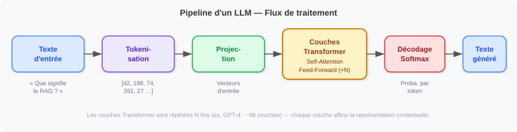
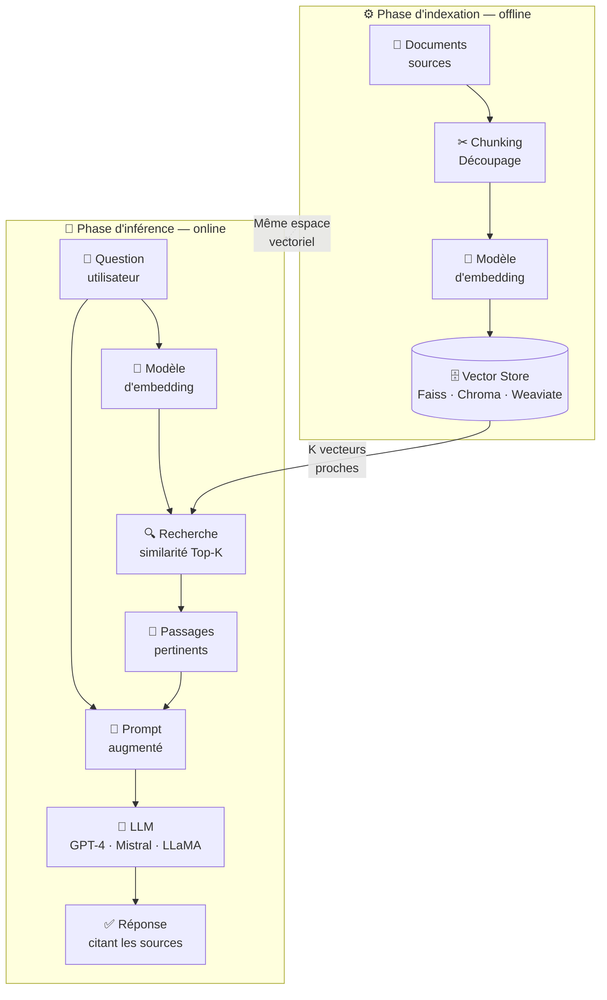
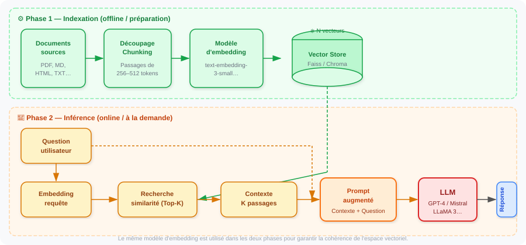
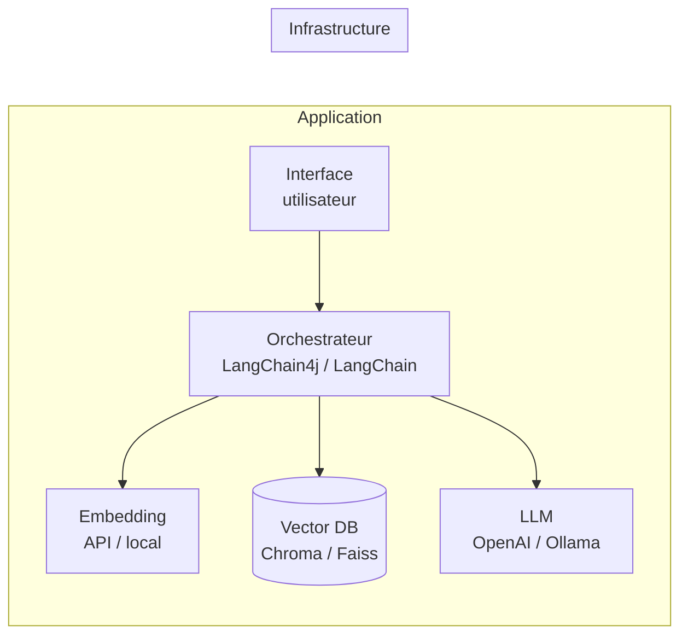
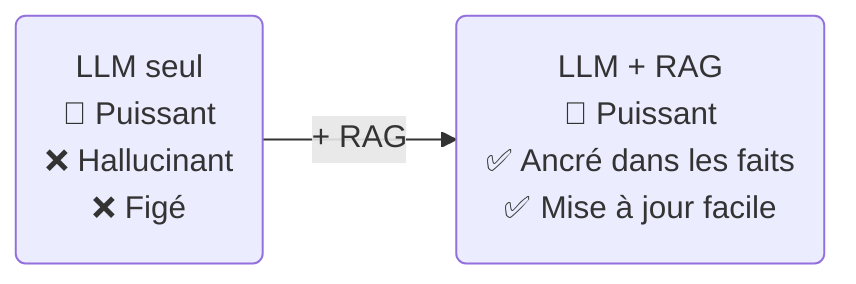

# Introduction aux LLM et au RAG

> **Résumé** — Ce document présente les fondamentaux des _Large Language Models_ (LLM) et de la technique _Retrieval-Augmented Generation_ (RAG) : leurs principes, leurs composants, leurs limites et un exemple concret d'implémentation.

---

## 1. Les LLM — Modèles de Langage de Grande Taille

### 1.1 Définition

Un **LLM** (_Large Language Model_) est un modèle de réseau de neurones entraîné sur des corpus textuels massifs pour prédire le token suivant dans une séquence. Cette tâche apparemment simple donne naissance à une capacité de généralisation remarquable : raisonnement, traduction, résumé, génération de code, etc.

Les modèles phares actuels sont : **GPT-4o** (OpenAI), **Claude 3** (Anthropic), **Gemini 1.5** (Google), **Mistral Large** et **LLaMA 3** (Meta, open-source).

### 1.2 Pipeline de traitement



| Étape                     | Rôle                                                                                      |
| ------------------------- | ----------------------------------------------------------------------------------------- |
| **Tokenisation**          | Découpe le texte en unités (tokens ≈ sous-mots) via un vocabulaire BPE ou SentencePiece   |
| **Projection**            | Associe chaque token à un vecteur dense d'entrée (_input embedding_)                      |
| **Couches Transformer**   | Calcule des représentations contextuelles via le mécanisme _Self-Attention_ (×N couches)  |
| **Décodage / Softmax**    | Produit une distribution de probabilité sur le vocabulaire pour choisir le prochain token |
| **Stratégie de décodage** | Greedy, Beam Search, ou échantillonnage (température, top-p)                              |

### 1.3 Limites des LLM seuls

| Limite                      | Description                                                                                              |
| --------------------------- | -------------------------------------------------------------------------------------------------------- |
| **Hallucinations**          | Le modèle peut « inventer » des faits inexistants avec une apparente confiance                           |
| **Coupure de connaissance** | Le modèle ne connaît pas les événements postérieurs à sa date d'entraînement (_knowledge cutoff_)        |
| **Contexte limité**         | Même avec de grandes fenêtres (128 k tokens), la totalité d'une base de connaissance ne peut pas y tenir |
| **Pas de source citée**     | Difficile de tracer quelle information a produit quelle réponse                                          |
| **Coût de re-entraînement** | Incorporer de nouvelles données propres nécessite un _fine-tuning_ coûteux                               |

---

## 2. RAG — Retrieval-Augmented Generation

### 2.1 Principe

Le **RAG** est une architecture qui vient _compléter_ un LLM plutôt que le remplacer. Au lieu de mémoriser toutes les connaissances dans les poids du modèle, on externalise la base de connaissance dans un **store vectoriel** et on la _récupère à la demande_ au moment de répondre.

```
Réponse = LLM ( question + documents_pertinents_retrouvés )
```

Le gain est triple : **fraîcheur** (les documents sont mis à jour sans re-entraîner le modèle), **précision** (les faits issus des sources réelles), et **traçabilité** (on peut citer la source).

### 2.2 Architecture des composants



### 2.3 Pipeline complet



### 2.4 Composants clés détaillés

#### Chunking — Découpage des documents

Le découpage conditionne la qualité de la recherche. Stratégies courantes :

- **Taille fixe** : fenêtre glissante de 256–512 tokens avec chevauchement (_overlap_) de 10–20 %
- **Sémantique** : découpage aux frontières de paragraphes ou de sections
- **Récursif** : LangChain `RecursiveCharacterTextSplitter` — essaie `\n\n`, puis `\n`, puis `.`

#### Embedding — Vectorisation

Le texte est converti en un vecteur dense (768 à 3 072 dimensions) qui encode sa _sémantique_.  
Deux passages proches dans cet espace partagent un sens similaire.

| Modèle                           | Dimensions | Contexte max | Cas d'usage                       |
| -------------------------------- | ---------- | ------------ | --------------------------------- |
| `text-embedding-3-small`         | 1 536      | 8 191 tokens | Usage général, économique         |
| `text-embedding-3-large`         | 3 072      | 8 191 tokens | Précision maximale                |
| `all-MiniLM-L6-v2` (open-source) | 384        | 512 tokens   | Local, léger, rapide              |
| `nomic-embed-text` (Ollama)      | 768        | 8 192 tokens | Local, bon rapport qualité/taille |

#### Vector Store — Base de vecteurs

| Solution     | Type                 | Point fort                            |
| ------------ | -------------------- | ------------------------------------- |
| **Faiss**    | In-process           | Ultra-rapide, idéal pour prototyper   |
| **Chroma**   | Serveur léger        | Simple à déployer, persistance locale |
| **Weaviate** | Cloud/on-prem        | Scalable, multi-modal                 |
| **pgvector** | Extension PostgreSQL | S'intègre dans une base existante     |
| **Qdrant**   | Rust-natif           | Performances élevées, filtrage riche  |

#### Recherche — Similarité cosinus

$$\text{sim}(\vec{q}, \vec{d}) = \frac{\vec{q} \cdot \vec{d}}{|\vec{q}|\ |\vec{d}|}$$

Les **K** passages ayant les scores les plus élevés sont inclus dans le prompt.  
K varie typiquement entre 3 et 10 selon la taille du contexte disponible et la précision souhaitée.

---

## 3. Implémentation — Exemple pratique

### 3.1 Stack technique



### 3.2 Exemple Python avec LangChain

Installation des dépendances :

```bash
pip install langchain langchain-openai langchain-chroma pypdf
```

#### Indexation des documents

```python
from langchain_community.document_loaders import PyPDFDirectoryLoader
from langchain.text_splitter import RecursiveCharacterTextSplitter
from langchain_openai import OpenAIEmbeddings
from langchain_chroma import Chroma

# 1. Chargement des documents
loader = PyPDFDirectoryLoader("./docs/")
documents = loader.load()

# 2. Découpage (chunking)
splitter = RecursiveCharacterTextSplitter(
    chunk_size=512,
    chunk_overlap=64,
    separators=["\n\n", "\n", ". ", " "]
)
chunks = splitter.split_documents(documents)

# 3. Vectorisation et stockage
embeddings = OpenAIEmbeddings(model="text-embedding-3-small")
vector_store = Chroma.from_documents(
    documents=chunks,
    embedding=embeddings,
    persist_directory="./chroma_db"
)
print(f"Indexé : {len(chunks)} passages dans le Vector Store.")
```

#### Pipeline de question-réponse (RAG)

```python
from langchain_openai import ChatOpenAI
from langchain.chains import RetrievalQA
from langchain.prompts import PromptTemplate

# Chargement du store existant
vector_store = Chroma(
    persist_directory="./chroma_db",
    embedding_function=OpenAIEmbeddings(model="text-embedding-3-small")
)

# Template de prompt — injecte le contexte retrouvé
PROMPT_TEMPLATE = """Tu es un assistant expert. 
Utilise uniquement les informations du CONTEXTE ci-dessous pour répondre.
Si la réponse n'est pas dans le contexte, réponds "Je ne sais pas."

CONTEXTE :
{context}

QUESTION : {question}

RÉPONSE :"""

prompt = PromptTemplate(
    template=PROMPT_TEMPLATE,
    input_variables=["context", "question"]
)

# Chaîne RAG
llm = ChatOpenAI(model="gpt-4o-mini", temperature=0)
rag_chain = RetrievalQA.from_chain_type(
    llm=llm,
    chain_type="stuff",           # concatène tous les passages dans un seul prompt
    retriever=vector_store.as_retriever(search_kwargs={"k": 5}),
    chain_type_kwargs={"prompt": prompt},
    return_source_documents=True  # pour tracer les sources
)

# Interrogation
result = rag_chain.invoke({"query": "Qu'est-ce que le RAG ?"})
print(result["result"])
print("\nSources :")
for doc in result["source_documents"]:
    print(f"  - {doc.metadata.get('source', '?')} p.{doc.metadata.get('page', '?')}")
```

### 3.3 Exemple Java avec LangChain4j

```xml
<!-- pom.xml -->
<dependency>
    <groupId>dev.langchain4j</groupId>
    <artifactId>langchain4j</artifactId>
    <version>0.31.0</version>
</dependency>
<dependency>
    <groupId>dev.langchain4j</groupId>
    <artifactId>langchain4j-open-ai</artifactId>
    <version>0.31.0</version>
</dependency>
<dependency>
    <groupId>dev.langchain4j</groupId>
    <artifactId>langchain4j-chroma</artifactId>
    <version>0.31.0</version>
</dependency>
```

```java
import dev.langchain4j.data.document.loader.FileSystemDocumentLoader;
import dev.langchain4j.data.document.splitter.DocumentSplitters;
import dev.langchain4j.model.embedding.onnx.allminilml6v2.AllMiniLmL6V2EmbeddingModel;
import dev.langchain4j.store.embedding.chroma.ChromaEmbeddingStore;
import dev.langchain4j.rag.content.retriever.EmbeddingStoreContentRetriever;
import dev.langchain4j.service.AiServices;

// ── Interface déclarative du service RAG ────────────────────────────────────
interface DocumentAssistant {
    String answer(String question);
}

public class RagExample {

    public static void main(String[] args) {

        // 1. Modèle d'embedding local (ONNX, sans clé API)
        var embeddingModel = new AllMiniLmL6V2EmbeddingModel();

        // 2. Vector store (Chroma doit tourner localement)
        var store = ChromaEmbeddingStore.builder()
                .baseUrl("http://localhost:8000")
                .collectionName("my-docs")
                .build();

        // 3. Indexation
        var documents = FileSystemDocumentLoader.loadDocuments("./docs");
        var splitter = DocumentSplitters.recursive(512, 64);
        var segments = splitter.splitAll(documents);
        var embeddings = embeddingModel.embedAll(segments).content();
        store.addAll(embeddings, segments);

        // 4. Retriever
        var retriever = EmbeddingStoreContentRetriever.builder()
                .embeddingStore(store)
                .embeddingModel(embeddingModel)
                .maxResults(5)
                .minScore(0.6)
                .build();

        // 5. Service RAG déclaratif
        var assistant = AiServices.builder(DocumentAssistant.class)
                .chatLanguageModel(OpenAiChatModel.withApiKey(System.getenv("OPENAI_API_KEY")))
                .contentRetriever(retriever)
                .build();

        // 6. Requête
        System.out.println(assistant.answer("Qu'est-ce que le RAG ?"));
    }
}
```

### 3.4 Utilisation locale avec Ollama (sans clé API)

Pour un déploiement entièrement local et gratuit :

```bash
# Installer Ollama, puis télécharger les modèles
ollama pull nomic-embed-text    # Embedding
ollama pull mistral              # LLM génération
```

```python
from langchain_ollama import OllamaEmbeddings, OllamaLLM

embeddings = OllamaEmbeddings(model="nomic-embed-text")
llm        = OllamaLLM(model="mistral", temperature=0)
# Le reste du pipeline RAG est identique
```

---

## 4. Bonnes pratiques

| Domaine           | Recommandation                                                                                |
| ----------------- | --------------------------------------------------------------------------------------------- |
| **Chunking**      | Préférer le découpage sémantique (paragraphes) au découpage brut par taille                   |
| **Chevauchement** | Conserver 10–15 % de chevauchement entre chunks pour ne pas couper le sens                    |
| **Métadonnées**   | Stocker source, date, auteur dans les métadonnées des chunks pour la traçabilité              |
| **Re-ranking**    | Ajouter un re-ranker (Cohere, `cross-encoder/ms-marco`) après le Top-K pour affiner           |
| **Prompt**        | Indiquer explicitement au LLM de répondre "Je ne sais pas" si le contexte est insuffisant     |
| **Évaluation**    | Utiliser RAGAS (_Faithfulness_, _Answer Relevancy_, _Context Recall_) pour mesurer la qualité |
| **Sécurité**      | Ne jamais inclure de données sensibles dans les vecteurs sans contrôle d'accès sur le store   |

---

## 5. Conclusion

Le RAG réconcilie deux besoins contradictoires : la **puissance générale** des LLM et la **précision factuelle** d'une base de connaissance maîtrisée. Son adoption est aujourd'hui la voie privilégiée pour intégrer des LLM dans des applications métier sans re-entraînement.



Les prochaines évolutions (RAG agentique, _Graph RAG_, _Multimodal RAG_) enrichissent encore ce paradigme en permettant des raisonnements multi-étapes sur des bases de connaissance hétérogènes.

---

*Document rédigé le 21 mars 2026 — illustrations : `src/docs/illustrations/llm-and-rag/`*
