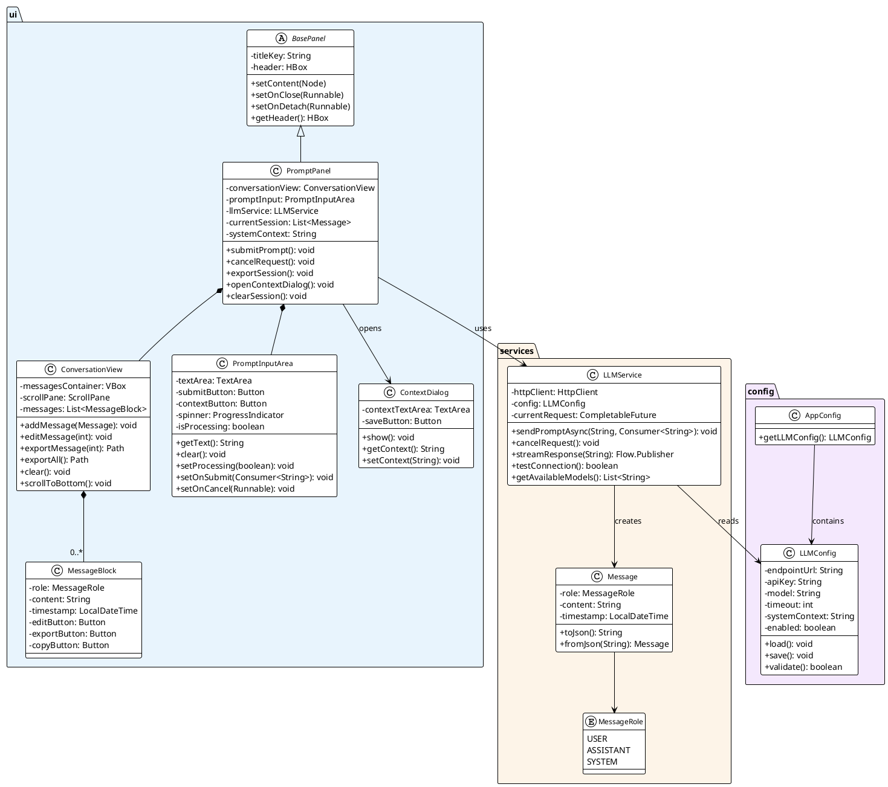
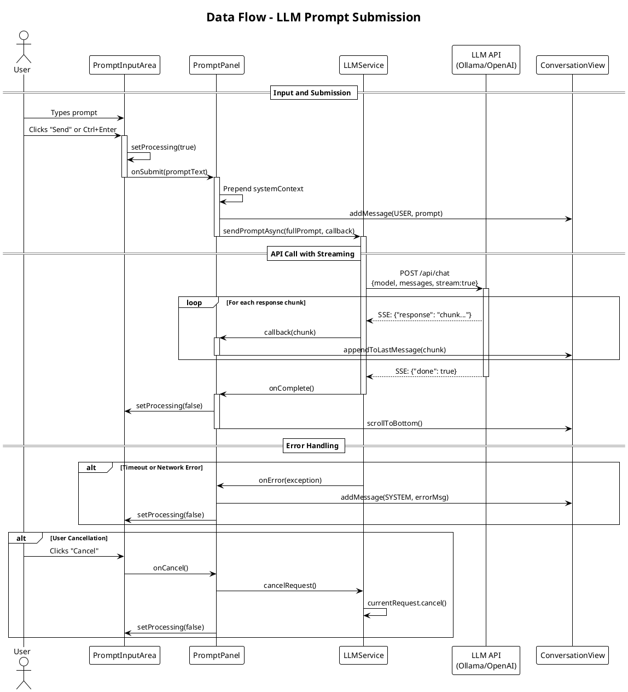
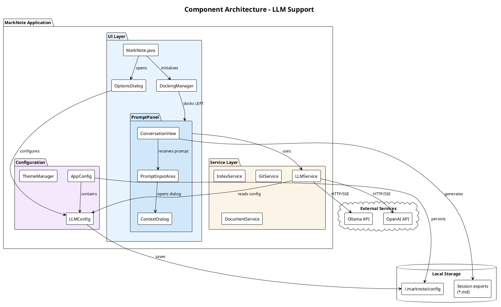
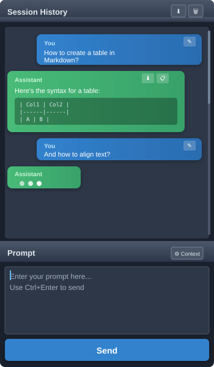
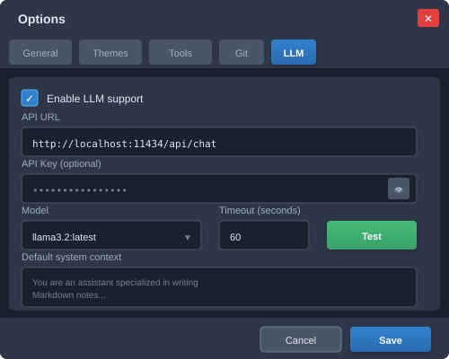

# Feasibility Study — LLM Prompt Support

**Document**: Feasibility Analysis and Cost Estimation  
**Version**: 1.0  
**Date**: March 15, 2026  
**Author**: MarkNote Development Team

---

## 1. Executive Summary

Integrating an LLM chat panel (`PromptPanel`) into MarkNote is **technically feasible** with the existing architecture. The docking system, panel patterns, and configuration infrastructure are well suited for this extension.

| Criteria | Assessment |
|----------|------------|
| **Technical Feasibility** | ✅ High |
| **Complexity** | 🟡 Medium |
| **Risks** | 🟡 Moderate (external API dependency) |
| **Estimated Effort** | 8-12 developer days |

---

## 2. Existing Architecture Analysis

### 2.1 Identified Integration Points

The codebase analysis reveals a modular architecture well suited for extension:

| Component | Role | Reusability |
|-----------|------|-------------|
| `BasePanel` | Base class for dockable panels | ✅ Direct extension |
| `DockingManager` | Zone management (LEFT, RIGHT, etc.) | ✅ Compatible |
| `OptionsDialog` | Multi-tab configuration screen | ✅ Easy tab addition |
| `AppConfig` | Settings persistence | ✅ Simple extension |
| `Detachable` | Extraction to separate tab | ✅ Optional |

### 2.2 Reusable Patterns

- **Panel Pattern**: `BasePanel` provides header, toolbar, and close/detach management
- **Callback Pattern**: Use of `setOnClose()`, `setOnDetach()` for communication
- **Singleton Pattern**: `AppConfig.getInstance()` for global configuration
- **Async Pattern**: `Platform.runLater()` for UI callbacks from background threads

### 2.3 Technical Dependencies

The project already uses:
- JavaFX (UI)
- RichTextFX (rich text editing)
- ProcessBuilder (system command execution)
- No existing HTTP client → **need to add a library**

---

## 3. Proposed Architecture

### 3.1 New Components

```
src/main/java/
├── ui/
│   ├── PromptPanel.java          # Main LLM panel
│   ├── ConversationView.java     # History zone (2/3)
│   ├── PromptInputArea.java      # Input zone (1/3)
│   └── ContextDialog.java        # System context dialog
├── services/
│   └── LLMService.java           # LLM API client
└── config/
    └── LLMConfig.java            # LLM connection configuration
```

### 3.2 Class Diagram



### 3.3 Data Flow



### 3.4 Component Architecture



### 3.5 Interface Mockups

#### PromptPanel (Main Panel)



The panel is divided into two zones:
- **History Zone (2/3)**: Displays the conversation with visual differentiation for user/assistant, action buttons per message (edit, export, copy)
- **Prompt Zone (1/3)**: Input area with context button and send/cancel button

#### LLM Configuration Tab



The configuration tab allows defining:
- API endpoint URL
- API key (hidden by default)
- Model selection
- Connection timeout
- Default system context

---

## 4. Detailed Functional Specifications

### 4.1 History Zone (ConversationView)

| Feature | Priority | Complexity |
|---------|----------|------------|
| User/assistant message display | P0 | Low |
| Markdown rendering in responses | P0 | Medium |
| Auto-scroll | P0 | Low |
| Export button per message | P1 | Low |
| Full session export | P1 | Low |
| Edit previous prompt → resubmit | P1 | Medium |
| Copy response text | P2 | Low |

### 4.2 Prompt Zone (PromptInputArea)

| Feature | Priority | Complexity |
|---------|----------|------------|
| Multi-line TextArea | P0 | Low |
| Dynamic Submit / Cancel button | P0 | Low |
| Keyboard shortcut (Ctrl+Enter) | P1 | Low |
| Processing indicator (spinner) | P1 | Low |
| Context definition button | P1 | Medium |

### 4.3 LLM Configuration

| Parameter | Type | Description |
|-----------|------|-------------|
| `llmEndpointUrl` | String | LLM API URL |
| `llmApiKey` | String | Authentication token |
| `llmModel` | String | Model to use (e.g., `llama3.2`) |
| `llmTimeout` | Integer | Timeout in seconds |
| `llmSystemContext` | String | Default system context |
| `llmEnabled` | Boolean | Panel activation |

---

## 5. Technical Considerations

### 5.1 Communication Protocol

**Option A: OpenAI/Ollama-compatible REST API (Recommended)**
- Standard format `/api/chat` or `/v1/chat/completions`
- Streaming support via Server-Sent Events (SSE)
- Available libraries: java.net.http.HttpClient (JDK 11+)

**Option B: MCP (Model Context Protocol)**
- Newer Anthropic protocol
- Requires stdio or SSE implementation
- Increased complexity

**Recommendation**: Implement Ollama/OpenAI REST API first, MCP in V2.

### 5.2 Streaming Management

```java
// Proposed pattern for streaming
HttpClient client = HttpClient.newHttpClient();
HttpRequest request = HttpRequest.newBuilder()
    .uri(URI.create(endpoint + "/api/chat"))
    .POST(BodyPublishers.ofString(jsonBody))
    .header("Content-Type", "application/json")
    .build();

client.sendAsync(request, BodyHandlers.ofLines())
    .thenAccept(response -> {
        response.body().forEach(line -> {
            Platform.runLater(() -> updateConversation(line));
        });
    });
```

### 5.3 Session Persistence

| Option | Advantages | Disadvantages |
|--------|------------|---------------|
| Not persisted | Simple | Lost on close |
| JSON files | Portable | Cleanup management |
| SQLite | Fast search | Additional dependency |

**Recommendation**: Start without persistence (V1), add JSON in V2.

### 5.4 Error Handling

- Configurable connection timeout
- Automatic retry (3 attempts)
- Localized error messages
- Fallback if service unavailable

---

## 6. Cost Estimation

### 6.1 Component Breakdown

| Component | Effort (h) | Priority | Dependencies |
|-----------|------------|----------|--------------|
| **LLMService** (API client) | 8-12h | P0 | - |
| **LLMConfig** (config model) | 2h | P0 | - |
| **PromptPanel** (structure) | 4-6h | P0 | LLMService |
| **PromptInputArea** | 4-6h | P0 | - |
| **ConversationView** | 8-12h | P0 | - |
| **ContextDialog** | 3-4h | P1 | - |
| **Config Tab OptionsDialog** | 4-6h | P0 | LLMConfig |
| **Integration MarkNote.java** | 2-3h | P0 | All |
| **Unit tests** | 6-8h | P0 | All |
| **Integration tests** | 4-6h | P1 | All |
| **User documentation** | 3-4h | P2 | - |
| **Internationalization (i18n)** | 2-3h | P1 | - |

### 6.2 Timeline Summary

| Phase | Duration | Deliverables |
|-------|----------|--------------|
| **Phase 1 - Core** | 4-5 days | LLMService, Config, Basic panel |
| **Phase 2 - UI** | 2-3 days | Complete ConversationView, styling |
| **Phase 3 - Features** | 1-2 days | Export, editing, context |
| **Phase 4 - QA** | 1-2 days | Tests, fixes, polish |

**Total estimated**: **8-12 developer days**

### 6.3 Required Resources

| Resource | Quantity | Notes |
|----------|----------|-------|
| Java/JavaFX Developer | 1 | Full time |
| Ollama/LLM Instance | 1 | For testing |
| Test environment | 1 | Linux/Mac/Win |

---

## 7. Risks and Mitigations

| Risk | Probability | Impact | Mitigation |
|------|-------------|--------|------------|
| LLM API unavailable | Medium | High | Degraded mode, explicit messages |
| High network latency | Medium | Medium | Streaming, visual indicators |
| API tokens exhausted | Low | Medium | Quota management in UI |
| API version incompatibility | Medium | Medium | LLMService abstraction |
| Large responses | Low | Low | ListView virtualization |
| Session memory leaks | Low | Medium | Explicit cleanup |

---

## 8. Recommended Implementation Plan

### Sprint 1 (5 days) — Foundations

1. **Day 1-2**: `LLMService` + `LLMConfig`
   - HTTP client with streaming
   - Testing with local Ollama
   
2. **Day 3**: Configuration tab
   - URL, API Key, Model fields
   - "Test connection" button
   
3. **Day 4-5**: Basic `PromptPanel`
   - 2/3 history, 1/3 input structure
   - Functional Submit/Cancel
   - DockingManager integration

### Sprint 2 (4 days) — Enhancement

4. **Day 6-7**: Complete `ConversationView`
   - Markdown rendering for responses
   - User/assistant differentiation
   - Scroll and auto-scroll
   
5. **Day 8**: Export features
   - Single message export
   - Full session export
   
6. **Day 9**: `ContextDialog` + prompt editing
   - System context dialog
   - Edit and resubmit

### Sprint 3 (3 days) — Finalization

7. **Day 10**: Tests & i18n
   - Service unit tests
   - FR/EN/DE/ES/IT translations
   
8. **Day 11**: UI Polish
   - CSS consistent with existing themes
   - Icons and animations
   
9. **Day 12**: Documentation
   - User guide
   - Release notes

---

## 9. Alternatives Considered

### 9.1 External Plugin Integration

| Pros | Cons |
|------|------|
| Decoupling | Distribution complexity |
| Independent updates | Less integrated UX |

**Decision**: Native integration preferred for UX consistency.

### 9.2 WebView with Web Interface

| Pros | Cons |
|------|------|
| Easy modern interface | JavaScript dependency |
| Existing components (React) | Memory overhead |

**Decision**: Native JavaFX for performance and consistency.

---

## 10. Conclusion

The `PromptPanel` implementation is **technically mature** and integrates naturally into MarkNote's existing architecture. Key advantages:

- ✅ Reuse of `BasePanel` and `DockingManager`
- ✅ Simple extension of `AppConfig` and `OptionsDialog`
- ✅ Already established async patterns (`Platform.runLater`)
- ✅ No major refactoring required

**Recommendation**: Proceed with implementation in 2 sprints (9-12 days), starting with the core LLMService and basic panel before enriching features.

---

## Appendices

### A. i18n Keys to Add

```properties
# messages.properties
llm.panel.title=LLM Chat
llm.prompt.placeholder=Enter your prompt...
llm.submit=Send
llm.cancel=Cancel
llm.context.button=System Context
llm.context.title=Define System Context
llm.export.message=Export Response
llm.export.session=Export Session
llm.config.tab=LLM
llm.config.url=API Endpoint URL
llm.config.apikey=API Key
llm.config.model=Model
llm.config.test=Test Connection
llm.config.test.success=Connection successful
llm.config.test.failure=Connection failed
llm.error.timeout=Request timed out
llm.error.connection=Unable to connect to LLM service
```

### B. Session JSON Structure (for export)

```json
{
  "version": "1.0",
  "exportDate": "2026-03-15T10:30:00Z",
  "model": "llama3.2",
  "systemContext": "You are a helpful assistant...",
  "messages": [
    {
      "role": "user",
      "content": "Explain markdown syntax",
      "timestamp": "2026-03-15T10:25:00Z"
    },
    {
      "role": "assistant", 
      "content": "# Markdown Syntax\n\nMarkdown is...",
      "timestamp": "2026-03-15T10:25:12Z"
    }
  ]
}
```

### C. CSS Example for ConversationView

```css
.conversation-message {
    -fx-padding: 10px;
    -fx-background-radius: 8px;
    -fx-margin: 5px;
}

.conversation-message.user {
    -fx-background-color: derive(-fx-accent, 40%);
    -fx-alignment: center-right;
}

.conversation-message.assistant {
    -fx-background-color: -fx-control-inner-background;
    -fx-alignment: center-left;
}

.conversation-toolbar {
    -fx-padding: 5px;
    -fx-spacing: 5px;
}
```
