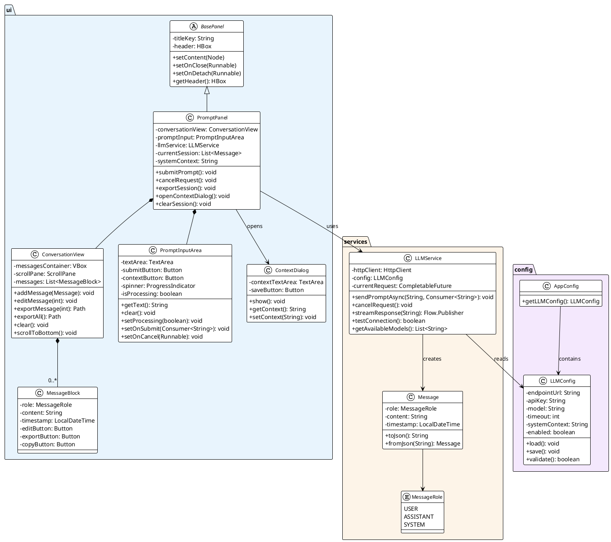
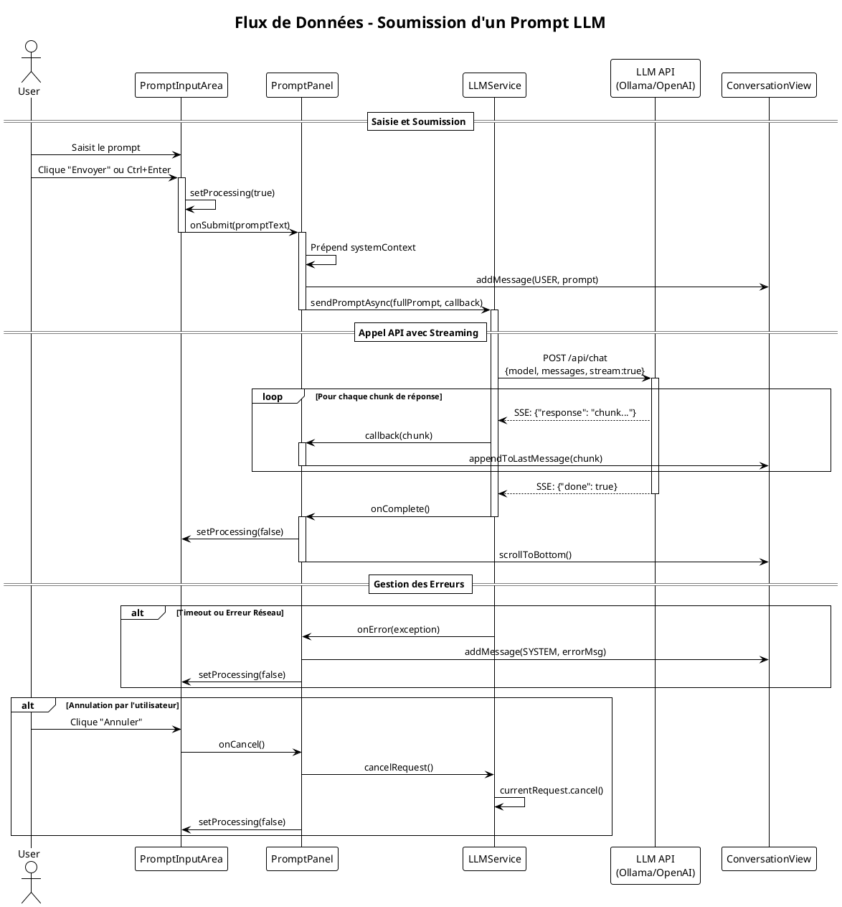
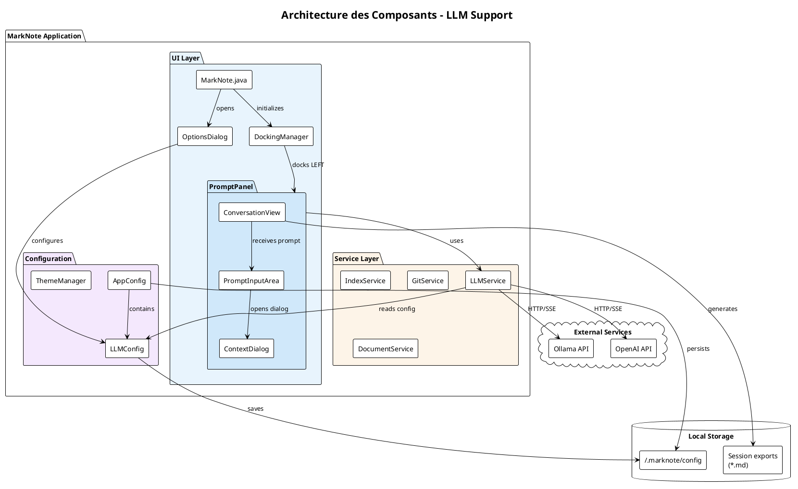
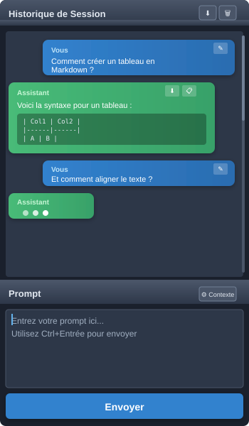
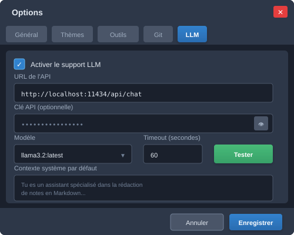

# Étude de Faisabilité — LLM Prompt Support

**Document**: Analyse de faisabilité et estimation des coûts  
**Version**: 1.0  
**Date**: 15 mars 2026  
**Auteur**: Équipe de développement MarkNote

---

## 1. Résumé Exécutif

L'intégration d'un panel de chat LLM (`PromptPanel`) dans MarkNote est **techniquement faisable** avec l'architecture existante. Le système de docking, les patterns de panels et l'infrastructure de configuration sont bien adaptés à cette extension.

| Critère | Évaluation |
|---------|------------|
| **Faisabilité technique** | ✅ Élevée |
| **Complexité** | 🟡 Moyenne |
| **Risques** | 🟡 Modérés (dépendance API externe) |
| **Effort estimé** | 8-12 jours développeur |

---

## 2. Analyse de l'Architecture Existante

### 2.1 Points d'Intégration Identifiés

L'analyse du codebase révèle une architecture modulaire bien adaptée :

| Composant | Rôle | Réutilisabilité |
|-----------|------|-----------------|
| `BasePanel` | Classe mère des panels dockables | ✅ Extension directe |
| `DockingManager` | Gestion des zones (LEFT, RIGHT, etc.) | ✅ Compatible |
| `OptionsDialog` | Écran de configuration multi-onglets | ✅ Ajout d'onglet facile |
| `AppConfig` | Persistance des paramètres | ✅ Extension simple |
| `Detachable` | Extraction en tab séparé | ✅ Optionnel |

### 2.2 Patterns Réutilisables

- **Pattern Panel** : `BasePanel` fournit header, toolbar, et gestion close/detach
- **Pattern Callback** : Utilisation de `setOnClose()`, `setOnDetach()` pour la communication
- **Pattern Singleton** : `AppConfig.getInstance()` pour la configuration globale
- **Pattern Async** : `Platform.runLater()` pour les callbacks UI depuis threads background

### 2.3 Dépendances Techniques

Le projet utilise déjà :
- JavaFX (UI)
- RichTextFX (édition de texte enrichi)
- ProcessBuilder (exécution de commandes système)
- Pas de client HTTP existant → **nécessité d'ajouter une bibliothèque**

---

## 3. Architecture Proposée

### 3.1 Nouveaux Composants

```
src/main/java/
├── ui/
│   ├── PromptPanel.java          # Panel principal LLM
│   ├── ConversationView.java     # Zone historique (2/3)
│   ├── PromptInputArea.java      # Zone de saisie (1/3)
│   └── ContextDialog.java        # Dialogue de contexte système
├── services/
│   └── LLMService.java           # Client API LLM
└── config/
    └── LLMConfig.java            # Configuration connexion LLM
```

### 3.2 Diagramme de Classes



### 3.3 Flux de Données



### 3.4 Architecture des Composants



### 3.5 Maquettes de l'Interface

#### PromptPanel (Panel Principal)



Le panel est divisé en deux zones :
- **Zone Historique (2/3)** : Affiche la conversation avec différenciation visuelle user/assistant, boutons d'action par message (éditer, exporter, copier)
- **Zone Prompt (1/3)** : Zone de saisie avec bouton contextuel et bouton d'envoi/annulation

#### Onglet Configuration LLM



L'onglet de configuration permet de définir :
- URL de l'endpoint API
- Clé API (masquée par défaut)
- Sélection du modèle
- Timeout de connexion
- Contexte système par défaut

---

## 4. Spécifications Fonctionnelles Détaillées

### 4.1 Zone Historique (ConversationView)

| Fonctionnalité | Priorité | Complexité |
|----------------|----------|------------|
| Affichage messages user/assistant | P0 | Faible |
| Rendu Markdown dans les réponses | P0 | Moyenne |
| Scroll automatique | P0 | Faible |
| Bouton export par message | P1 | Faible |
| Export session complète | P1 | Faible |
| Édition prompt précédent → relance | P1 | Moyenne |
| Copier texte réponse | P2 | Faible |

### 4.2 Zone Prompt (PromptInputArea)

| Fonctionnalité | Priorité | Complexité |
|----------------|----------|------------|
| TextArea multi-ligne | P0 | Faible |
| Bouton Submit / Cancel dynamique | P0 | Faible |
| Raccourci clavier (Ctrl+Enter) | P1 | Faible |
| Indicateur de processing (spinner) | P1 | Faible |
| Bouton définition contexte | P1 | Moyenne |

### 4.3 Configuration LLM

| Paramètre | Type | Description |
|-----------|------|-------------|
| `llmEndpointUrl` | String | URL de l'API LLM |
| `llmApiKey` | String | Token d'authentification |
| `llmModel` | String | Modèle à utiliser (ex: `llama3.2`) |
| `llmTimeout` | Integer | Timeout en secondes |
| `llmSystemContext` | String | Contexte système par défaut |
| `llmEnabled` | Boolean | Activation du panel |

---

## 5. Considérations Techniques

### 5.1 Protocole de Communication

**Option A : API REST compatible OpenAI/Ollama (Recommandé)**
- Format standard `/api/chat` ou `/v1/chat/completions`
- Support streaming via Server-Sent Events (SSE)
- Bibliothèques disponibles : java.net.http.HttpClient (JDK 11+)

**Option B : MCP (Model Context Protocol)**
- Protocole Anthropic plus récent
- Nécessite implémentation stdio ou SSE
- Complexité accrue

**Recommandation** : Implémenter d'abord l'API REST Ollama/OpenAI, MCP en V2.

### 5.2 Gestion du Streaming

```java
// Pattern proposé pour streaming
HttpClient client = HttpClient.newHttpClient();
HttpRequest request = HttpRequest.newBuilder()
    .uri(URI.create(endpoint + "/api/chat"))
    .POST(BodyPublishers.ofString(jsonBody))
    .header("Content-Type", "application/json")
    .build();

client.sendAsync(request, BodyHandlers.ofLines())
    .thenAccept(response -> {
        response.body().forEach(line -> {
            Platform.runLater(() -> updateConversation(line));
        });
    });
```

### 5.3 Persistance des Sessions

| Option | Avantages | Inconvénients |
|--------|-----------|---------------|
| Non persistées | Simple | Perte à la fermeture |
| Fichiers JSON | Portable | Gestion nettoyage |
| SQLite | Recherche rapide | Dépendance supplémentaire |

**Recommandation** : Commencer sans persistance (V1), ajouter JSON en V2.

### 5.4 Gestion des Erreurs

- Timeout de connexion configurable
- Retry automatique (3 tentatives)
- Messages d'erreur localisés
- Fallback si service indisponible

---

## 6. Estimation des Coûts

### 6.1 Décomposition par Composant

| Composant | Effort (h) | Priorité | Dépendances |
|-----------|------------|----------|-------------|
| **LLMService** (client API) | 8-12h | P0 | - |
| **LLMConfig** (modèle config) | 2h | P0 | - |
| **PromptPanel** (structure) | 4-6h | P0 | LLMService |
| **PromptInputArea** | 4-6h | P0 | - |
| **ConversationView** | 8-12h | P0 | - |
| **ContextDialog** | 3-4h | P1 | - |
| **Onglet Config OptionsDialog** | 4-6h | P0 | LLMConfig |
| **Integration MarkNote.java** | 2-3h | P0 | Tous |
| **Tests unitaires** | 6-8h | P0 | Tous |
| **Tests intégration** | 4-6h | P1 | Tous |
| **Documentation utilisateur** | 3-4h | P2 | - |
| **Internationalisation (i18n)** | 2-3h | P1 | - |

### 6.2 Synthèse Temporelle

| Phase | Durée | Livrables |
|-------|-------|-----------|
| **Phase 1 - Core** | 4-5 jours | LLMService, Config, Panel basique |
| **Phase 2 - UI** | 2-3 jours | ConversationView complète, styling |
| **Phase 3 - Features** | 1-2 jours | Export, édition, contexte |
| **Phase 4 - QA** | 1-2 jours | Tests, corrections, polish |

**Total estimé** : **8-12 jours développeur**

### 6.3 Ressources Nécessaires

| Ressource | Quantité | Notes |
|-----------|----------|-------|
| Développeur Java/JavaFX | 1 | Temps plein |
| Instance Ollama/LLM | 1 | Pour tests |
| Environnement de test | 1 | Linux/Mac/Win |

---

## 7. Risques et Mitigations

| Risque | Probabilité | Impact | Mitigation |
|--------|-------------|--------|------------|
| API LLM indisponible | Moyenne | Élevé | Mode dégradé, messages explicites |
| Latence réseau élevée | Moyenne | Moyen | Streaming, indicateurs visuels |
| Tokens API épuisés | Faible | Moyen | Gestion quota dans UI |
| Incompatibilité API versions | Moyenne | Moyen | Abstraction LLMService |
| Réponses volumineuses | Faible | Faible | Virtualisation ListView |
| Fuites mémoire sessions | Faible | Moyen | Nettoyage explicite |

---

## 8. Plan d'Implémentation Recommandé

### Sprint 1 (5 jours) — Fondations

1. **Jour 1-2** : `LLMService` + `LLMConfig`
   - Client HTTP avec streaming
   - Tests avec Ollama local
   
2. **Jour 3** : Onglet configuration
   - Champs URL, API Key, Model
   - Bouton "Test connexion"
   
3. **Jour 4-5** : `PromptPanel` basique
   - Structure 2/3 historique, 1/3 input
   - Submit/Cancel fonctionnel
   - Intégration DockingManager

### Sprint 2 (4 jours) — Enrichissement

4. **Jour 6-7** : `ConversationView` complète
   - Rendu Markdown des réponses
   - Différenciation user/assistant
   - Scroll et auto-scroll
   
5. **Jour 8** : Fonctionnalités export
   - Export message unitaire
   - Export session complète
   
6. **Jour 9** : `ContextDialog` + édition prompts
   - Dialogue contexte système
   - Édition et relance

### Sprint 3 (3 jours) — Finalisation

7. **Jour 10** : Tests & i18n
   - Tests unitaires services
   - Traductions FR/EN/DE/ES/IT
   
8. **Jour 11** : Polish UI
   - CSS cohérent avec thèmes existants
   - Icônes et animations
   
9. **Jour 12** : Documentation
   - Guide utilisateur
   - Notes de version

---

## 9. Alternatives Considérées

### 9.1 Intégration via Plugin Externe

| Pour | Contre |
|------|--------|
| Découplage | Complexité distribution |
| Mises à jour indépendantes | UX moins intégrée |

**Décision** : Intégration native préférée pour cohérence UX.

### 9.2 WebView avec Interface Web

| Pour | Contre |
|------|--------|
| Interface moderne facile | Dépendance JavaScript |
| Composants existants (React) | Overhead mémoire |

**Décision** : JavaFX natif pour performances et cohérence.

---

## 10. Conclusion

L'implémentation du `PromptPanel` est **techniquement mature** et s'intègre naturellement dans l'architecture existante de MarkNote. Les principaux avantages :

- ✅ Réutilisation de `BasePanel` et `DockingManager`
- ✅ Extension simple de `AppConfig` et `OptionsDialog`
- ✅ Patterns async déjà établis (`Platform.runLater`)
- ✅ Pas de refactoring majeur requis

**Recommandation** : Procéder à l'implémentation en 2 sprints (9-12 jours), en commençant par le core LLMService et le panel basique avant d'enrichir les fonctionnalités.

---

## Annexes

### A. Clés i18n à Ajouter

```properties
# messages.properties
llm.panel.title=LLM Chat
llm.prompt.placeholder=Enter your prompt...
llm.submit=Send
llm.cancel=Cancel
llm.context.button=System Context
llm.context.title=Define System Context
llm.export.message=Export Response
llm.export.session=Export Session
llm.config.tab=LLM
llm.config.url=API Endpoint URL
llm.config.apikey=API Key
llm.config.model=Model
llm.config.test=Test Connection
llm.config.test.success=Connection successful
llm.config.test.failure=Connection failed
llm.error.timeout=Request timed out
llm.error.connection=Unable to connect to LLM service
```

### B. Structure JSON Session (pour export)

```json
{
  "version": "1.0",
  "exportDate": "2026-03-15T10:30:00Z",
  "model": "llama3.2",
  "systemContext": "You are a helpful assistant...",
  "messages": [
    {
      "role": "user",
      "content": "Explain markdown syntax",
      "timestamp": "2026-03-15T10:25:00Z"
    },
    {
      "role": "assistant", 
      "content": "# Markdown Syntax\n\nMarkdown is...",
      "timestamp": "2026-03-15T10:25:12Z"
    }
  ]
}
```

### C. Exemple CSS pour ConversationView

```css
.conversation-message {
    -fx-padding: 10px;
    -fx-background-radius: 8px;
    -fx-margin: 5px;
}

.conversation-message.user {
    -fx-background-color: derive(-fx-accent, 40%);
    -fx-alignment: center-right;
}

.conversation-message.assistant {
    -fx-background-color: -fx-control-inner-background;
    -fx-alignment: center-left;
}

.conversation-toolbar {
    -fx-padding: 5px;
    -fx-spacing: 5px;
}
```
