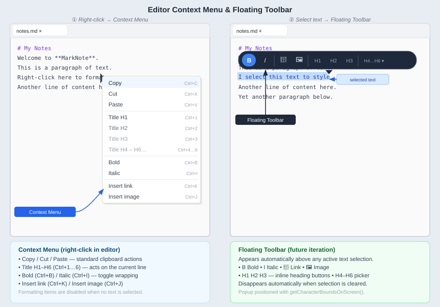

# Editor Context Menu

## Goal

Add a contextual menu (right-click) directly on the `StyleClassedTextArea editor` field inside `DocumentTab`.  
The menu must reflect the common Markdown formatting actions and provide keyboard shortcut equivalents.


---

## Implementation location

- **Class**: `ui/DocumentTab.java`
- **Target component**: `StyleClassedTextArea editor` (RichTextFX)
- **Attachment**: `editor.setContextMenu(createEditorContextMenu())` — same pattern as `ProjectExplorerPanel.createContextMenu()`.
- **Keyboard shortcuts**: extend the existing `editor.setOnKeyPressed(...)` handler (currently handling `Ctrl+F` and `Ctrl+H`).

---

## Menu structure

```
Copy          Ctrl+C
Cut           Ctrl+X
Paste         Ctrl+V
──────────────────────
Title H1      Ctrl+1
Title H2      Ctrl+2
Title H3      Ctrl+3
Title H4      Ctrl+4
Title H5      Ctrl+5
Title H6      Ctrl+6
──────────────────────
Bold          Ctrl+B
Italic        Ctrl+I
──────────────────────
Insert link   Ctrl+K
Insert image  Ctrl+J
```

---

## Behaviour per entry

### Copy / Cut / Paste
- Delegate directly to `editor.copy()`, `editor.cut()`, `editor.paste()`.
- These are standard JavaFX clipboard operations — no custom logic required.
- **Keyboard shortcuts**: OS-native (`Ctrl+C`, `Ctrl+X`, `Ctrl+V`) are already handled by RichTextFX; the menu items only need to call the API methods.

### Title H1 – H6 (`Ctrl+1` … `Ctrl+6`)
- Act on the **current line** (no selection required).
- Algorithm:
  1. Retrieve the paragraph index at the caret: `editor.getCurrentParagraph()`.
  2. Get the current paragraph text: `editor.getParagraph(idx).getText()`.
  3. Strip any existing leading `#` characters and the optional trailing space.
  4. Prepend the appropriate prefix (`#`, `##`, … `######`) followed by a space.
  5. Replace the paragraph in-place using `editor.replaceText(start, end, newLine)`.
- If the line already has the same heading level, toggle it off (remove the prefix).

### Bold (`Ctrl+B`)
- Requires a **non-empty selection**.
- Wrap the selected text: `**<SELECTION>**`.
- Place the caret at the end of the wrapped text after insertion.
- If the selection is already surrounded by `**`, unwrap it instead (toggle behaviour).
- Item is **disabled** in the context menu when `editor.getSelection().getLength() == 0`.

### Italic (`Ctrl+I`)
- Same toggle logic as Bold, using single asterisks: `*<SELECTION>*`.
- Item is **disabled** when no text is selected.

### Insert link (`Ctrl+K`)
- Requires a **non-empty selection** which becomes the URL part of the link.
- Inserts: `[<CURSOR>](<TEXT_SELECTED>)` where `<CURSOR>` marks where the caret lands after insertion (i.e., between `[` and `]`).
- Concrete steps:
  1. Read `String url = editor.getSelectedText()`.
  2. Replace selection with `"[]("+url+")"`.
  3. Move caret to position `selectionStart + 1` (inside the brackets).
- Item is **disabled** when no text is selected.

> [!WARNING]
> **Keyboard conflict**: `Ctrl+H` is already bound in `DocumentTab` to open the Search & Replace bar (`searchReplaceBar.showSearchAndReplace()`).  
> The original spec proposed `Ctrl+H` for *Insert link* — this would break the search feature.  
> **Decision**: use `Ctrl+K` for *Insert link* (consistent with VS Code, IntelliJ, Typora).  
> The `Ctrl+H` binding for Search & Replace is kept unchanged.

### Insert image (`Ctrl+J`)
- Same logic as *Insert link* but with the image syntax.
- Inserts: `` — caret lands at position `selectionStart + 2` (inside `![` … `]`).
- Item is **disabled** when no text is selected.

---

## Conditional item enabling

Set the menu's `onShowing` handler to enable/disable items depending on context:

```java
contextMenu.setOnShowing(e -> {
    boolean hasSelection = editor.getSelection().getLength() > 0;
    boldItem.setDisable(!hasSelection);
    italicItem.setDisable(!hasSelection);
    insertLinkItem.setDisable(!hasSelection);
    insertImageItem.setDisable(!hasSelection);
    // Copy/Cut also require a selection
    copyItem.setDisable(!hasSelection);
    cutItem.setDisable(!hasSelection);
});
```

---

## Internationalisation

Add the following keys to every `messages_*.properties` file:

```properties
# Editor context menu
editor.menu.copy=Copy
editor.menu.cut=Cut
editor.menu.paste=Paste
editor.menu.heading=Title H{0}
editor.menu.bold=Bold
editor.menu.italic=Italic
editor.menu.insertLink=Insert link
editor.menu.insertImage=Insert image
```

---

## Floating toolbar (later)

> [!NOTE]
> In a subsequent iteration, a floating toolbar will appear **above the selection** whenever the user selects text in the editor.  
> It will expose the same formatting actions (Bold, Italic, Insert link, Insert image, heading level picker) as icon buttons or a combo-box, without requiring the context menu.  
> Implementation hint: listen to `editor.selectedTextProperty()` changes; when selection becomes non-empty, compute the screen coordinates of the selection start via `editor.getCharacterBoundsOnScreen(start, end)` and position a `Popup` node accordingly.

