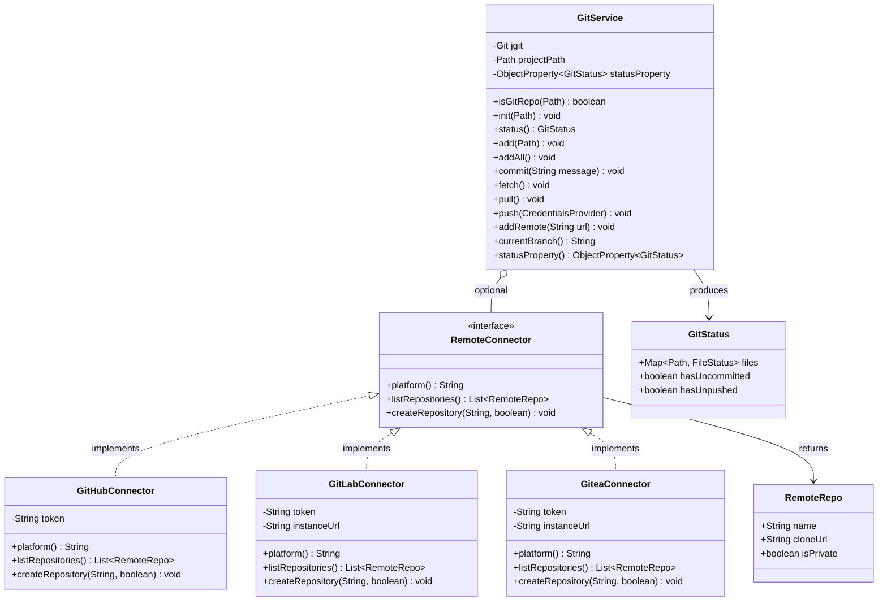

# Git client and connector

## Context

The Project Explorer already displays per-file Git status indicators (green = tracked, orange = modified, red = untracked). The next step is to expose the full Git workflow directly inside MarkNote — initialising repositories, staging files, committing, and syncing with a remote — without requiring the user to leave the editor.

Git operations are delegated to **JGit** (Eclipse JGit library), embedded as a Maven dependency. JGit is a pure-Java implementation of the Git core, which avoids any dependency on a system-installed `git` binary and gives full programmatic control over every operation.

All Git logic is encapsulated in a dedicated **`GitService`** class (see [Architecture](#architecture) below), keeping the UI layer thin.

## Illustration


The illustration shows:

- **Toolbar** (top): three new git buttons (↓ Pull, ↑ Push, ✓ Commit) prepended before the existing ⇅ Sync and ↻ Index buttons; a dark branch badge (⎇ main) on the right shows the currently checked-out branch. The new buttons are only rendered when the open project folder is a Git repository.
- **File tree**: coloured status dots on the right edge of each row — green (tracked/staged), orange (modified), red (untracked).
- **Right-click context menu** (right panel): available on any file in the tree; `+ git add` is highlighted as the primary action for untracked files.
- **Root folder callout** (bottom): shows the additional entries that appear only when right-clicking the project root and Git has not been initialised yet.

## Proposal

### 1. Git repository initialisation

When the user opens a project folder that does **not** contain a `.git/` sub-directory, the Project Explorer toolbar shows a single `⚙ Init Git…` button instead of the Pull/Push/Commit group. Clicking it:

1. Calls `GitService.init(projectPath)` which runs `git init` via JGit, creating `.git/` and setting the default branch to `main`.
2. Immediately proceeds to identity setup (see §2).
3. Once identity is confirmed, proposes to stage and commit all existing project files (see §3).

Alternatively, right-clicking the **root folder** in the tree always exposes `⚙ Initialize Git repository…` at the top of the context menu when no `.git/` is present.

### 2. Git user identity setup

After initialisation (or when performing a first commit on an existing repo that has no identity configured), `GitService` checks — in order — the local repo config (`<repo>/.git/config`) and the global config (`~/.gitconfig`) for `user.name` and `user.email`.

If either value is missing, a small modal dialog prompts the user to provide both. The values are written to the **local** repo config only (`git config --local user.name …`), leaving the global config untouched unless the user explicitly checks an *"Apply globally"* option.


### 3. Initial add + commit

Immediately after a successful `git init` + identity setup, a confirmation dialog lists all non-ignored files in the project directory and asks:

> *"Add all files and create an initial commit?"*

- **Confirm**: `GitService.addAll()` stages every file, then `GitService.commit("Initial commit")` creates the first commit.
- **Cancel**: the repo is left empty; the user can stage files manually later via the context menu.

### 4. Remote repository setup

The first time the user clicks **↑ Push** (or selects `↑ Push` from the context menu) when no remote is configured, an **Add Remote** dialog appears:

| Field                | Description                                                                                  |
|----------------------|----------------------------------------------------------------------------------------------|
| Remote URL           | HTTPS or SSH URL (e.g. `https://github.com/user/repo.git` or `git@github.com:user/repo.git`) |
| Authentication       | Selector: **None / Basic / Token / SSH key**                                                 |
| Username             | Visible for Basic and Token auth                                                             |
| Password / Token     | Visible for Basic and Token auth; masked input                                               |
| SSH private key path | Visible for SSH auth; file-picker                                                            |
| SSH passphrase       | Visible for SSH auth; optional, masked                                                       |

Credentials are stored in `~/.marknote/config` (plain-text, owner-readable only, `chmod 600`). The remote is registered as `origin` in the local repo config. After the remote is saved the push is retried automatically.

> [!IMPORTANT] No support for branching or merging is proposed for now. At repo initialisation the default branch `main` is used, and all sync operations target the currently checked-out branch.

## UI changes

### Toolbar buttons (new)

Three buttons are prepended to the existing toolbar and are only visible when the open project is a Git repository:

| Button     | Shortcut | Action                                                                  |
|------------|----------|-------------------------------------------------------------------------|
| `↓ Pull`   | —        | Fetch + fast-forward merge from `origin/<branch>`                       |
| `↑ Push`   | —        | Push local commits to `origin/<branch>`; prompts Add Remote if none set |
| `✓ Commit` | —        | Opens the Commit dialog                                                 |

A read-only **branch badge** (dark pill, e.g. `⎇ main`) appears at the right end of the toolbar, showing the current branch name. It is refreshed whenever a commit, pull, or push completes.

### Context menu — files

Right-clicking any file in the tree appends a **Git** section (preceded by a separator) to the existing file context menu:

| Entry                 | Condition                     | Action                                            |
|-----------------------|-------------------------------|---------------------------------------------------|
| `+ git add`           | File is untracked or modified | Stages the file (`git add <path>`)                |
| `✓ Commit…`           | Always                        | Opens Commit dialog with this file pre-selected   |
| `↓ Pull`              | Repo has a remote             | Pull from origin                                  |
| `↑ Push`              | Repo has a remote             | Push to origin                                    |
| `↺ Fetch`             | Repo has a remote             | Fetch from origin (no merge)                      |
| `✗ Remove from index` | File is tracked               | Unstages / removes from index (`git rm --cached`) |

### Context menu — root folder

Right-clicking the **root folder** node shows the same Git section as for files, plus two entries at the top when the project is not yet a Git repository:

| Entry                          | Condition                              |
|--------------------------------|----------------------------------------|
| `⚙ Initialize Git repository…` | No `.git/` present                     |
| `⊕ Add Remote…`                | Repo exists but has no `origin` remote |

### File status indicators

Status dots are rendered as small coloured circles on the right edge of each tree row (as currently):

| Colour | Meaning                              |
|--------|--------------------------------------|
| Green  | Tracked and up to date (clean)       |
| Orange | Tracked but locally modified (dirty) |
| Red    | Untracked (not in the index)         |

The dots are refreshed asynchronously after every Git operation and after every file save.

## Supported operations

### `git fetch`

Downloads new objects and refs from `origin` without modifying the working tree or the current branch. Used to inspect remote changes before deciding to pull.

### `git pull`

Equivalent to `git fetch` followed by `git merge --ff-only`. If the fast-forward fails (diverged history), the operation is aborted and the user is notified with a clear message; no merge commit is created automatically.

### `git add`

Stages one file (from the context menu) or all files (from the Commit dialog's *Stage all* button). Uses JGit's `AddCommand`.

### `git commit`

Opens the **Commit dialog** (see [Dialogs](#dialogs)). The user writes a commit message, reviews staged files, and confirms. The commit is local only; a subsequent Push is required to publish it.

### `git push`

Pushes all local commits on the current branch to `origin/<branch>`. If the remote has diverged, the push is rejected and the user is prompted to pull first.

## Dialogs

### Commit dialog

A modal dialog containing:

- **Commit message** — multi-line text area (min 3 rows); the first line is used as the commit title.
- **Staged files** — a read-only list of files currently in the index (`git diff --cached --name-only`), each with its status letter (A = added, M = modified, D = deleted).
- **Stage all** button — runs `git add .` and refreshes the staged list.
- **Confirm** / **Cancel** buttons.

The dialog validates that the message is non-empty and that at least one file is staged before enabling Confirm.

### Add Remote / Credentials dialog

A single-page modal with the fields listed in §4 (Proposal). The auth type selector shows/hides the relevant credential fields dynamically. A **Test Connection** button optionally calls `git ls-remote <url>` to verify connectivity before saving.


## Architecture

### Package structure

All Git-related classes are organized under the `services.git` package:

**Production classes** (`src/main/java/services/git/`):

- `GitService.java` — Singleton service wrapping JGit API
- `RemoteConnector.java` — Interface for platform-specific Git remote APIs
- `RemoteConnectorException.java` — Checked exception for API errors
- `RemoteConnectorFactory.java` — Static factory for platform detection and connector instantiation
- `GitHubConnector.java` — GitHub REST API v3 connector
- `GitLabConnector.java` — GitLab API v4 connector (public and self-hosted)
- `GiteaConnector.java` — Gitea API v1 connector (self-hosted only)

**Test classes** (`src/test/java/services/git/`):

- `RemoteConnectorFactoryTest.java` — URL parsing and platform detection tests
- `RemoteConnectorExceptionTest.java` — Exception construction and error message tests
- `RemoteRepoTest.java` — RemoteRepo record validation tests

### `GitService` class

A singleton service (instantiated by `MarkNote` at startup, injected where needed) that wraps JGit's `Git` API:

```java
public class GitService {
    public boolean isGitRepo(Path projectPath);
    public void init(Path projectPath) throws GitAPIException;
    public GitStatus status() throws GitAPIException;          // per-file status map
    public void add(Path file) throws GitAPIException;
    public void addAll() throws GitAPIException;
    public void commit(String message) throws GitAPIException;
    public void fetch() throws GitAPIException;
    public void pull() throws GitAPIException;
    public void push(CredentialsProvider creds) throws GitAPIException;
    public void addRemote(String url) throws GitAPIException;
    public String currentBranch() throws IOException;
}
```

The service fires JavaFX property-change events after each mutating operation so that the Project Explorer and status badge can update themselves on the UI thread.

### `RemoteConnector` interface

An optional extension point for platform-specific integrations (GitHub, Gitea, GitLab REST APIs):

```java
public interface RemoteConnector {
    String platform();                     // "github", "gitea", "gitlab"
    List<RemoteRepo> listRepositories();
    void createRepository(String name, boolean isPrivate);
}
```

Implementing this interface later will enable features like browsing remote repositories, creating a repo from within MarkNote, or retrieving CI status — without touching `GitService`.

### Diagramme UML



## Options — Git configuration tab

A dedicated **Git** tab is added to the Options dialog (`Help → Options… → Git`). It contains two sections.

### Toolbar mode

A radio-button selector controls which Git controls are displayed in the Project Explorer toolbar:

| Mode         | Description                                                                                                                                                                                                                                                                               |
|--------------|-------------------------------------------------------------------------------------------------------------------------------------------------------------------------------------------------------------------------------------------------------------------------------------------|
| **Standard** | Only the existing `⇅ Sync` and `↻ Index` buttons are shown. The branch badge is displayed but is read-only (label only, no interaction). This is the default mode; it is appropriate for users who do not need direct Git interaction from within MarkNote.                               |
| **Advanced** | All Git buttons are active: `↓ Pull`, `↑ Push`, `✓ Commit`, `↻ Index`, `⇅ Sync`, and the `⎇ <branch>` badge. Selecting the branch badge opens a read-only dropdown listing existing local branches; switching branches is intentionally not supported (no branching operations in scope). |

> [!IMPORTANT] IMPORTANT
> Even in **Standard** mode the per-file Git status dots (green / orange / red) and the root-folder context-menu entries (Init, Add Remote…) remain visible and functional. The mode only governs the toolbar buttons.

The selected mode is persisted in `~/.marknote/config` under the key `git.toolbarMode` with values `standard` (default) or `advanced`.

### Remote credentials

This section regroups the credentials fields described in §4 (Proposal / Remote repository setup):

- Saved remote URL
- Authentication type selector (None / Basic / Token / SSH key)
- Username, Password/Token, SSH key path, SSH passphrase (shown according to auth type)
- **Test Connection** button

Credentials are stored in `~/.marknote/config` with `chmod 600`.

## Dependencies

Add **JGit** to `pom.xml`:

```xml
<dependency>
    <groupId>org.eclipse.jgit</groupId>
    <artifactId>org.eclipse.jgit</artifactId>
    <version>7.1.0.202411261347-r</version>
</dependency>
```

No additional native binaries are required. JGit bundles all transitive dependencies and runs on any platform supported by MarkNote.

## ToDo

1. Stage 1 - GitService

    - [x] Use plan mode to prepare the implementation,
    - [x] wait for plan approval before proceeding,
    - [x] write a dedicated specification in `src/docs/git-client-and-connector-implementation.md`,
    - [x] add JGit dependency to `pom.xml`,
    - [x] implement `GitService` with all operations listed above,
    - [x] update Project Explorer toolbar (Pull / Push / Commit buttons + branch badge),
    - [x] add Git section to file and root-folder context menus,
    - [x] implement Commit dialog,
    - [x] implement Add Remote / Credentials dialog,
    - [x] wire status dot refresh to post-operation events,
    - [x] add Git tab in Options dialog (toolbar mode: standard / advanced; remote credentials).

2. Stage 2 - git RemoteConnector

    **Goal**: Implement connectors for interacting with GitHub, GitLab, and Gitea REST APIs to list repositories and create new remote repositories directly from MarkNote.

    **Architecture decisions**:
    - Use existing `java.net.http.*` HttpClient (already used in UpdateChecker)
    - Parse JSON responses with `org.json.simple` (already in dependencies for LLM config)
    - Token-based authentication only (credentials already stored in AppConfig)
    - Return empty lists on API errors, log via LogService
    - Static factory for platform detection from remote URLs

    **Phase 1: Core Infrastructure** (parallel steps)

    - [x] Create `RemoteConnector` interface in `src/main/java/utils/RemoteConnector.java`
        - Define methods: `platform()`, `listRepositories()`, `createRepository(String name, boolean isPrivate)`
        - Define `RemoteRepo` record: `name`, `cloneUrl`, `description`, `isPrivate`, `defaultBranch`
        - Add JavaDoc describing contract and authentication expectations

    - [x] Create `RemoteConnectorException` class in `src/main/java/utils/RemoteConnectorException.java`
        - Checked exception with HTTP status code, API message, and cause
        - User-friendly error messages for common HTTP codes (401, 403, 404, 429, 500+)

    - [x] Create `RemoteConnectorFactory` utility in `src/main/java/utils/RemoteConnectorFactory.java`
        - Static method `create(String remoteUrl, String token)` → returns appropriate connector or null
        - URL parsing logic to detect platform (github.com, gitlab.com, custom domains)
        - Support for custom GitLab and Gitea instances
        - Uses JGit's URIish for parsing HTTPS and SSH URLs

    **Phase 2: Platform Implementations** (parallel steps)

    - [x] Implement `GitHubConnector` in `src/main/java/utils/GitHubConnector.java`
        - Constructor: `GitHubConnector(String token)`
        - API base: `https://api.github.com`
        - `listRepositories()`: GET `/user/repos?type=owner&per_page=100&sort=updated`
        - `createRepository()`: POST `/user/repos` with JSON body `{"name": "...", "private": true/false, "auto_init": true}`
        - Auth header: `Authorization: token <token>`, API version: `X-GitHub-Api-Version: 2022-11-28`
        - Uses java.net.http.HttpClient with 10s connection timeout

    - [x] Implement `GitLabConnector` in `src/main/java/utils/GitLabConnector.java`
        - Constructors: `GitLabConnector(String token)` for gitlab.com, `GitLabConnector(String instanceUrl, String token)` for custom
        - Support custom instances (default: `https://gitlab.com`)
        - API base: `<instanceUrl>/api/v4`
        - `listRepositories()`: GET `/projects?owned=true&per_page=100&order_by=updated_at&sort=desc`
        - `createRepository()`: POST `/projects` with JSON body `{"name": "...", "visibility": "private"/"public", "initialize_with_readme": true}`
        - Auth header: `PRIVATE-TOKEN: <token>`

    - [x] Implement `GiteaConnector` in `src/main/java/utils/GiteaConnector.java`
        - Constructor: `GiteaConnector(String instanceUrl, String token)`
        - Support custom instances only (no default, user provides URL)
        - API base: `<instanceUrl>/api/v1`
        - `listRepositories()`: GET `/user/repos?limit=100`
        - `createRepository()`: POST `/user/repos` with JSON body `{"name": "...", "private": true/false, "auto_init": true, "default_branch": "main"}`
        - Auth header: `Authorization: token <token>`

    **Phase 3: Testing & Error Handling**

    - [x] Create unit tests in `src/test/java/utils/`
        - `RemoteConnectorFactoryTest`: 14 tests for URL parsing, platform detection, connector instantiation
        - `RemoteConnectorExceptionTest`: 11 tests for exception construction, status codes, error messages
        - `RemoteRepoTest`: 11 tests for record validation, null handling, default values
        - Total: 36 tests, all passing

    - [x] Add error handling and logging
        - All HTTP exceptions wrapped in `RemoteConnectorException` with detailed context
        - Log API errors via `LogService` with sources "GitHubConnector", "GitLabConnector", "GiteaConnector"
        - Handle common errors: 401 Unauthorized, 403 Forbidden, 404 Not Found, 429 Rate Limited, 500+ Server errors
        - Throw `RemoteConnectorException` on errors (user-friendly messages for UI display)
        - Extract error messages from JSON responses (GitHub: "message", GitLab: "message" or "error")

    **Verification steps**:
    - [x] Unit tests: `mvn test -Dtest=RemoteConnectorFactoryTest,RemoteConnectorExceptionTest,RemoteRepoTest` → 36 tests passed
    - [x] Compilation: `mvn clean compile -DskipTests` → BUILD SUCCESS (no warnings)
    - [x] Factory validation: Correctly identifies github.com, gitlab.com, custom GitLab, and Gitea from HTTPS/SSH URLs
    - [x] Error handling: All connectors throw RemoteConnectorException with HTTP status codes and API messages

    **Design decisions** (confirmed during implementation):
    - **JSON library**: `org.json.simple` (already in classpath for LLM config)
    - **HTTP client**: `java.net.http.HttpClient` with 10s timeout (consistent with UpdateChecker pattern)
    - **Custom domains**: Auto-detect gitlab.com; for self-hosted GitLab/Gitea, extract base URL from remote URL
    - **Error handling**: Throw `RemoteConnectorException` with HTTP status + API message (UI can display user-friendly errors)
    - **Factory pattern**: Static utility with `create()` and `detectPlatform()` methods (no caching, lightweight connectors)
    - **GitLab detection**: Check for "gitlab.com" first, then "gitlab" substring for self-hosted instances
    - **Default branch**: Normalize to "main" if null/blank in RemoteRepo record
    - **Authentication**: Token-based only (stored in AppConfig, chmod 600)
    - **Scope**: Repository operations only; no issues, PRs, CI status (deferred to future Stage 4+)

3. Stage 3 - UI Integration

    **Goal**: Integrate RemoteConnector functionality into MarkNote's Git UI to enable browsing remote repositories, creating new repositories, and selecting remotes from GitHub/GitLab/Gitea.

    **Context**:
    - Stage 1 Completed: GitService + full Git UI (dialogs, toolbar, menus)
    - Stage 2 Completed: RemoteConnector backend (GitHub/GitLab/Gitea APIs)

    **Architecture Decisions**:
    1. **Integration points**: Add "Browse Repositories" and "Create Repository" dialogs accessible from AddRemoteDialog, GitOptionsTab, and root context menu
    2. **Token management**: Reuse token from AddRemoteDialog/Options (simpler, most users use same token for Git and API)
    3. **Error handling**: Inline error labels for non-critical errors (rate limit, 404), Alert dialogs for auth failures

    **Phase 1: Repository Browser Dialog (NEW)**

    - [ ] Create `RemoteRepositoryBrowserDialog.java` in `src/main/java/ui/` (~300 lines)
        - UI components: ComboBox (platform), PasswordField (token), Button (Test/Refresh), ListView (repos with custom cell renderer), Label (status)
        - Constructor: `RemoteRepositoryBrowserDialog(Window owner, String platform, String token)`
        - Behavior: Auto-load repos on open, Test button validates token, Refresh re-fetches list, Select/double-click returns RemoteRepo
        - Methods: `loadRepositories()`, `handleTestConnection()`, `handleRefresh()`, `handleSelect()`, `getSelectedRepository()`
        - Error handling: 401/403 → "Invalid token", 429 → "Rate limit exceeded", network → "Connection failed", empty → "No repositories found"
        - Thread safety: API calls in background thread, UI updates via Platform.runLater

    **Phase 2: Create Repository Dialog (NEW)**

    - [ ] Create `CreateRemoteRepositoryDialog.java` in `src/main/java/ui/` (~250 lines)
        - UI components: ComboBox (platform), PasswordField (token), Button (Test), TextField (name with validation), TextField (description), CheckBox (private, default true), CheckBox (init README, default true), Label (status)
        - Constructor: `CreateRemoteRepositoryDialog(Window owner, String platform, String token)`
        - Validation: Enable Create button only if valid name (alphanumeric + dash/underscore, no spaces)
        - Methods: `validateForm()`, `handleTestConnection()`, `handleCreate()`, `getCreatedRepository()`
        - Error handling: 401/403 → "Authentication failed", 409 → "Repository name already exists", 422 → "Invalid repository name"

    **Phase 3: Enhance AddRemoteDialog**

    - [ ] Modify `src/main/java/ui/AddRemoteDialog.java` (add ~80 lines)
        - Add "Browse…" button next to Remote URL field (enabled when token entered)
            - Opens RemoteRepositoryBrowserDialog with detected platform
            - On selection: fills URL field with repo's cloneUrl
        - Add "Create New…" button next to Remote URL field (enabled when token entered)
            - Opens CreateRemoteRepositoryDialog with detected platform
            - On success: fills URL field with created repo's cloneUrl
        - Auto-detect platform from URL using `RemoteConnectorFactory.detectPlatform()`
            - Display hint: "Detected: GitHub" / "Detected: GitLab" / "Detected: Gitea"
        - Implementation: Button disable bindings to tokenField, handlers `handleBrowseRepositories()` and `handleCreateRepository()`

    **Phase 4: Enhance GitOptionsTab**

    - [ ] Modify `src/main/java/ui/GitOptionsTab.java` (add ~60 lines)
        - Add "Remote Repositories" section below credentials
            - Shows current remote URL if configured
            - Buttons: "Browse Repositories…" and "Create Repository…"
        - Implementation: `buildRemoteRepoSection()`, handlers `handleBrowseFromOptions()` and `handleCreateFromOptions()`
        - Behavior: Browse/Create may update config or offer to set as remote after success

    **Phase 5: Context Menu Integration**

    - [ ] Modify `src/main/java/ui/ProjectExplorerPanel.java` (add ~40 lines)
        - Add "⊕ Create Remote Repository…" to root folder context menu (when no remote configured)
        - Implementation: Handler `handleCreateRemoteRepository()` checks token in AppConfig, opens CreateRemoteRepositoryDialog, offers to set as remote on success
        - Workflow: Create repo → confirmation dialog → `gitService.addRemote(repo.cloneUrl())` → success message

    **Phase 6: Testing**

    - [ ] Create unit tests in `src/test/java/ui/`
        - `RemoteRepositoryBrowserDialogTest.java` (~200 lines): Test repo list rendering, selection logic, error display, mock RemoteConnector responses
        - `CreateRemoteRepositoryDialogTest.java` (~150 lines): Test form validation, create button enable/disable, success/error scenarios, mock RemoteConnector.createRepository()

    - [ ] Manual testing scenarios
        - AddRemoteDialog integration: Enter token → Browse enables → lists repos → select → URL populated
        - AddRemoteDialog integration: Click Create New → dialog opens → repo created → URL filled
        - GitOptionsTab integration: Browse/Create buttons work, token validation
        - Context menu: Right-click root → Create Remote Repository → confirm → remote configured → push works
        - Error scenarios: Invalid token, rate limit, network error, empty repo list

    - [ ] Integration testing workflows
        - **Workflow 1 (New project)**: Init Git → commit → right-click root → Create Remote Repository → enter token → create private repo → confirm set as remote → push succeeds
        - **Workflow 2 (Existing repo)**: Open project (no remote) → Options → Git → Browse Repositories → select → confirm → pull/push work
        - **Workflow 3 (Token reuse)**: Configure token in Options → AddRemoteDialog auto-uses token → Browse/Create work without re-entering

    **Files Summary**:
    - **New files**: RemoteRepositoryBrowserDialog.java (~300 lines), CreateRemoteRepositoryDialog.java (~250 lines)
    - **Modified files**: AddRemoteDialog.java (+80 lines), GitOptionsTab.java (+60 lines), ProjectExplorerPanel.java (+40 lines)
    - **Test files**: RemoteRepositoryBrowserDialogTest.java (~200 lines), CreateRemoteRepositoryDialogTest.java (~150 lines)
    - **Total estimate**: ~1080 lines

    **Risks & Mitigations**:
    - Token security → Use PasswordField (masked), never log tokens
    - API rate limits → Show clear error on 429, cache repo lists for 5 minutes
    - Network latency → All calls in background threads, show loading spinners
    - Platform differences → Already handled in Stage 2 connectors, test each platform
    - User confusion → Clear labels, tooltips, inline help

    **Future Enhancements (Stage 4+)**:
    - Show repo description/stats in browser dialog
    - Filter repos by visibility, search by name
    - Clone repos directly from browser dialog
    - CI/CD status indicators, GitHub/GitLab issues integration, PR creation

> [!IMPORTANT] GitService class
> The Git client is a big feature; create it as a dedicated `GitService` class and keep all JGit calls inside it. The UI layer must never import JGit directly.

> [!NOTE] Git connector implementation
> The `RemoteConnector` interface is intentionally left unimplemented in the first iteration. It opens the door to future GitHub / Gitea / GitLab integrations without requiring any rework of `GitService`.
