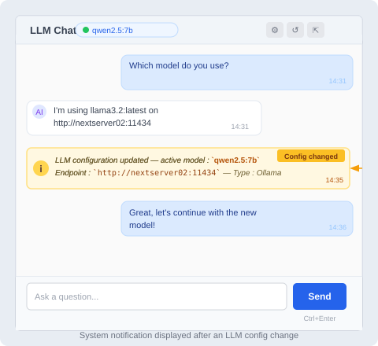
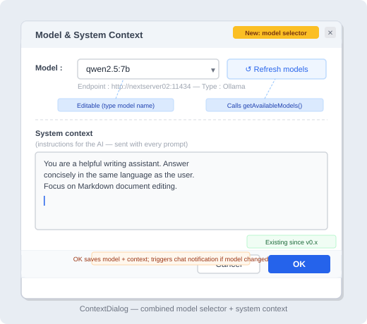

# Enhancement of LLM Chat

## Chat Auto-scroll (ConversationView)

**Problem**

`scrollToBottom()` was triggered before `adjustHeight()` had resized the `WebView`, causing incomplete scrolling during streaming.

**Fix**

An `onHeightChanged` callback is fired at the end of `adjustHeight()` in `MessageBlock`. Scrolling is now driven by this callback rather than being called directly from `appendToLastMessage()`.

## LLM Config Change Notification

When the LLM configuration changes (from `OptionsDialog` or from `ContextDialog`), the active chat displays a system message:

- `MarkNote.showOptionsDialog()` calls `llmConfig.load()` then `promptPanel.onConfigChanged()` after `OptionsDialog` closes
- `PromptPanel.onConfigChanged()` injects a `SYSTEM` role message into `ConversationView` with the active model and endpoint
- Dedicated CSS style: pale yellow background `#fff8e1`, border `#ffe082`, full width, italic

## ContextDialog — Model Selector

The ⚙ button in `PromptInputArea` now opens a combined **Model + Context** dialog:

- Top section: editable `ComboBox` pre-filled with the current model + **Refresh** button (calls `LLMService.getAvailableModels()`) + endpoint label in gray
- Separator
- Bottom section: system context `TextArea` (existing)
- If the model changes after <kbd>OK</kbd> → `onConfigChanged()` is called → notification posted in the chat.

