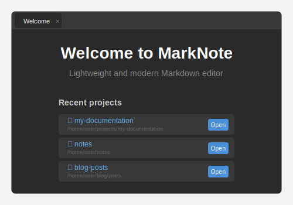
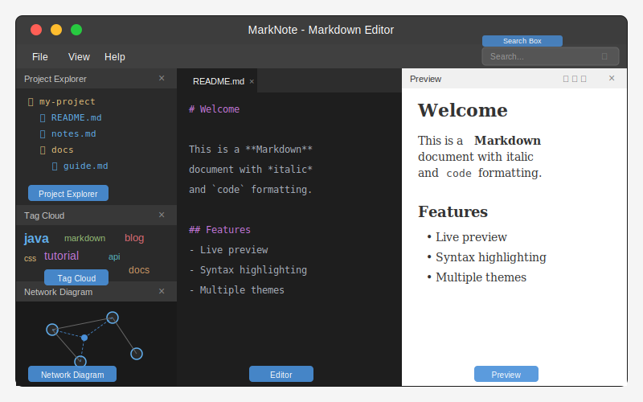
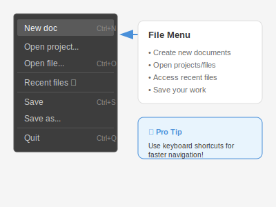
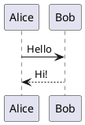
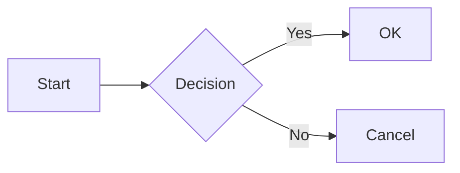
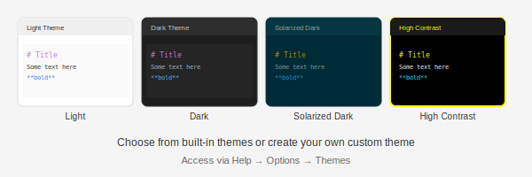
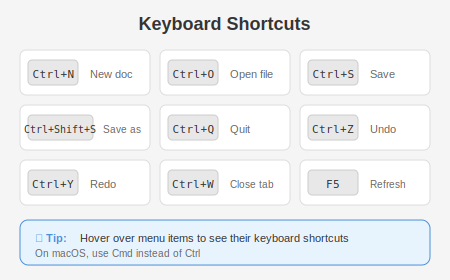

# MarkNote User Guide

Welcome to MarkNote, a lightweight and modern Markdown editor built with JavaFX. This guide will help you get started and make the most of MarkNote's features.

## Table of Contents

1. [Introduction](#introduction)
2. [Getting Started](#getting-started)
3. [Main Interface](#main-interface)
4. [Working with Documents](#working-with-documents)
5. [Project Explorer](#project-explorer)
6. [Live Preview](#live-preview)
7. [Splash Screen & About](#splash-screen--about)
8. [Themes](#themes)
9. [Options & Settings](#options--settings)
10. [Keyboard Shortcuts](#keyboard-shortcuts)
11. [Troubleshooting](#troubleshooting)

---

## Introduction

MarkNote is a cross-platform Markdown editor designed for writers, developers, and anyone who works with Markdown documents. It provides a distraction-free writing environment with real-time preview, project management, and customizable themes.

### Key Features

- **Markdown Editing** - Full-featured editor with syntax highlighting
- **Live Preview** - Real-time HTML rendering as you type
- **Syntax Highlighting** - Code blocks with automatic language detection and theme-coordinated coloring
- **Markdown Tables** - Full GFM table support with styled rendering
- **PlantUML Diagrams** - Render PlantUML diagrams directly in the preview
- **Mermaid Diagrams** - Render Mermaid flowcharts, sequences, and more in the preview
- **Math Equations** - LaTeX/MathML support via KaTeX (`$...$` inline, `$$...$$` block)
- **Project Explorer** - Browse and manage your project files
- **Multi-document Tabs** - Work on multiple files simultaneously
- **Theme Support** - Built-in themes with custom theme creation
- **Splash Screen** - Themed splash screen at startup (configurable)
- **Image Preview** - Quick preview for images with zoom and pan
- **Recent Projects** - Quick access to your recent work
- **Multi-language Support** - Available in 5 languages

---

## Getting Started

### First Launch

When you first launch MarkNote, you'll see the **Splash Screen** displaying the application name, version, author, and copyright. Click anywhere or wait a few seconds to dismiss it.

Then you'll be greeted with the **Welcome page**:



The Welcome page shows:
- A list of your recent projects (if any)
- Quick access buttons to open projects

### Opening a Project

1. Click **File → Open project...** in the menu
2. Navigate to your project folder
3. Click **Open**

Your project files will appear in the Project Explorer panel.

### Creating a New Document

1. Click **File → New doc** or press `Ctrl+N`
2. A new untitled document tab will open
3. Start writing your Markdown content

---

## Main Interface

MarkNote's interface is divided into three main areas:



### 1. Project Explorer (Left Panel)

Displays your project's file structure in a tree view. You can:
- Navigate through folders
- Double-click files to open them
- Right-click for context menu options

### 2. Editor (Center Panel)

The main editing area where you write your Markdown. Features include:
- Syntax highlighting for Markdown elements
- Tab-based interface for multiple documents
- Undo/Redo support
- Line numbers (optional)

### 3. Preview Panel (Right Panel)

Shows the rendered HTML output of your Markdown in real-time. Features:
- Navigation buttons (back/forward through history)
- Refresh button
- Clickable links that navigate within your project

### Toggling Panels

You can show or hide panels using the **View** menu:
- **View → Project explorer** - Toggle the left panel
- **View → Preview panel** - Toggle the right panel

---

## Working with Documents

### Creating Documents



**From the menu:**
- **File → New doc** (`Ctrl+N`) - Creates a new untitled document

**From Project Explorer:**
- Right-click on a folder → **New file**
- Enter a filename (include .md extension)

### Opening Documents

**From the menu:**
- **File → Open file...** (`Ctrl+O`) - Opens a file dialog
- **File → Recent files** - Shows recently opened files

**From Project Explorer:**
- Double-click any Markdown file to open it in a new tab

### Saving Documents

- **File → Save** (`Ctrl+S`) - Save the current document
- **File → Save as...** (`Ctrl+Shift+S`) - Save with a new name

When you try to close a modified document without saving, MarkNote will prompt you to save your changes.

### Working with Tabs

- Click on a tab to switch to that document
- Click the **×** button on a tab to close it
- Modified documents show a **•** indicator in the tab

---

## Project Explorer

The Project Explorer helps you manage your project files efficiently.


### Navigating Files

- **Single-click** - Select a file or folder
- **Double-click** - Open a file in the editor
- **Expand/Collapse** - Click the arrow icons to navigate folders

### Context Menu

Right-click on files or folders to access:

| Action | Description |
|--------|-------------|
| **New file** | Create a new file in the selected folder |
| **New folder** | Create a new subfolder |
| **Rename...** | Rename the selected item |
| **Delete** | Delete the selected item (with confirmation) |

### Drag and Drop

- **Move files** - Drag files/folders to reorganize your project
- **Copy external files** - Drag files from your file manager into MarkNote

### Supported File Types

| Type | Extensions | Action |
|------|------------|--------|
| Markdown | `.md`, `.markdown` | Opens in editor with preview |
| Text | `.txt`, `.text` | Opens in editor |
| Images | `.png`, `.jpg`, `.gif`, `.svg` | Opens in image preview |
| CSS | `.css` | Opens with CSS syntax highlighting |

---

## Live Preview

The Preview panel shows your Markdown rendered as HTML in real-time.

### Navigation

| Button | Description |
|--------|-------------|
| **◀** | Go back to previous state |
| **▶** | Go forward |
| **↻** | Refresh the preview |
| **×** | Close the preview panel |

### Clicking Links

When you click a Markdown link in the preview:
- **Local files** (relative paths) - Open in MarkNote
- **External URLs** - Open in your default browser

### Supported Markdown Features

MarkNote supports standard Markdown syntax plus extensions:

```markdown
# Headings (H1 through H6)

**Bold text** and *italic text*

`Inline code` and code blocks

- Bullet lists
- With multiple items

1. Numbered lists
2. Work too

[Links](https://example.com)


> Blockquotes

---
Horizontal rules
---

| Tables | Are | Supported |
|--------|-----|-----------|
| Data   | Goes| Here      |
```

### Code Syntax Highlighting

Fenced code blocks are automatically highlighted with language detection:

````markdown
```java
public class Hello {
    public static void main(String[] args) {
        System.out.println("Hello, world!");
    }
}
```
````

The syntax highlighting theme automatically adapts to your chosen application theme (e.g., a dark highlight.js theme is used with the Dark app theme).

### PlantUML Diagrams

Embed PlantUML diagrams directly in your Markdown using fenced code blocks:

````markdown

````

Diagrams are rendered as SVG images via the PlantUML server.

### Mermaid Diagrams

Mermaid diagrams are also supported:

````markdown

````

Mermaid diagrams are rendered client-side in the preview panel. The Mermaid theme adapts to your application theme.

### Math Equations (KaTeX)

MarkNote supports LaTeX math notation via KaTeX:

- **Inline math:** `$E = mc^2$` renders as an inline equation
- **Block math:**

```markdown
$$
\int_{-\infty}^{\infty} e^{-x^2} dx = \sqrt{\pi}
$$
```

---

## Splash Screen & About

### Splash Screen

When MarkNote starts, a themed splash screen is displayed showing:
- The application name and version
- Author and contact information
- Copyright notice

Click anywhere on the splash screen to dismiss it and continue to the main window.

The splash screen follows the current application theme (Light, Dark, Solarized, etc.). You can disable it in **Help → Options... → Misc. → Show splash screen on startup**.

### About Dialog

Access the same information at any time via **Help → About**. The About dialog displays the same content as the splash screen.

---

## Themes

MarkNote comes with several built-in themes and allows you to create custom themes.



### Built-in Themes

| Theme | Description |
|-------|-------------|
| **Light** | Clean white background (default) |
| **Dark** | Dark background, easy on the eyes |
| **Solarized Light** | Warm, low-contrast light theme |
| **Solarized Dark** | Popular dark theme with warm colors |
| **High Contrast** | Maximum contrast for accessibility |

### Changing Themes

1. Go to **Help → Options...**
2. Select the **Themes** tab
3. Click on your desired theme
4. Click **OK** to apply

### Creating Custom Themes

1. In the Themes options tab, click **Create theme...**
2. Enter a name for your theme
3. The theme editor will open with CSS code
4. Modify the CSS to customize colors and styles
5. Save the file (`Ctrl+S`)

Custom themes are stored in `~/.marknote/themes/`.

### Theme CSS Structure

```css
/* Main editor colors */
.code-area {
    -fx-background-color: #1e1e1e;
    -fx-text-fill: #abb2bf;
}

/* Markdown syntax highlighting */
.heading { -fx-fill: #c678dd; }
.bold { -fx-fill: #e06c75; }
.italic { -fx-fill: #98c379; }
.code { -fx-fill: #61afef; }
```

---

## Options & Settings

Access settings via **Help → Options...** or by pressing the shortcut shown in the menu.

### Misc. Tab

| Option | Description |
|--------|-------------|
| **Number of recent files/projects** | How many items to show in Recent menus (1-50) |
| **Create document on startup** | Automatically create a new document when starting |
| **Reopen last project on startup** | Remember and reopen your last project |
| **Show Welcome page on startup** | Display the Welcome tab when starting |
| **Show splash screen on startup** | Display the splash screen when starting (enabled by default) |
| **Language** | Choose your preferred interface language |

### Themes Tab

- View and select from available themes
- Create new custom themes
- Delete custom themes (built-in themes cannot be deleted)

### Language Settings

MarkNote supports the following languages:
- 🇫🇷 Français (French)
- 🇬🇧 English
- 🇩🇪 Deutsch (German)
- 🇪🇸 Español (Spanish)
- 🇮🇹 Italiano (Italian)

To change the language:
1. Go to **Help → Options...**
2. In the **Misc.** tab, select your language
3. The application will restart to apply the change

---

## Keyboard Shortcuts



### File Operations

| Shortcut | Action |
|----------|--------|
| `Ctrl+N` | New document |
| `Ctrl+O` | Open file |
| `Ctrl+S` | Save |
| `Ctrl+Shift+S` | Save as |
| `Ctrl+W` | Close current tab |
| `Ctrl+Q` | Quit application |

### Editing

| Shortcut | Action |
|----------|--------|
| `Ctrl+Z` | Undo |
| `Ctrl+Y` | Redo |
| `Ctrl+X` | Cut |
| `Ctrl+C` | Copy |
| `Ctrl+V` | Paste |
| `Ctrl+A` | Select all |

### Navigation

| Shortcut | Action |
|----------|--------|
| `Ctrl+Tab` | Next tab |
| `Ctrl+Shift+Tab` | Previous tab |
| `F5` | Refresh preview |

> **Note:** On macOS, use `Cmd` instead of `Ctrl`.

---

## Troubleshooting

### Common Issues

#### The preview is not updating

1. Click the **Refresh** button (↻) in the preview panel
2. Check that the Preview panel is visible (View → Preview panel)
3. Make sure you're editing a Markdown file (.md)

#### Files are not showing in Project Explorer

1. Make sure you've opened a project (File → Open project...)
2. Check that the Project Explorer is visible (View → Project explorer)
3. Try refreshing by closing and reopening the project

#### Theme changes are not applied

1. Make sure to save your custom theme CSS file
2. If editing the current theme, close and reopen options
3. Restart MarkNote if changes still don't appear

#### Application language didn't change

1. The application needs to restart after changing language
2. Try closing and reopening MarkNote manually
3. Check the language setting in Options → Misc.

### Getting Help

If you encounter issues not covered here:

1. Check the [GitHub repository](https://github.com/mcgivrer/marknote) for known issues
2. Submit a bug report with details about your system and the problem
3. Contact the author at contact.snapgames@gmail.com

---

## About MarkNote

**Version:** 0.0.2  
**Author:** Frédéric Delorme  
**Copyright:** © SnapGames 2026  
**License:** MIT  
**Repository:** https://github.com/mcgivrer/marknote

---

*This documentation is part of the MarkNote project. Last updated: February 2026.*
