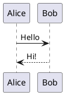
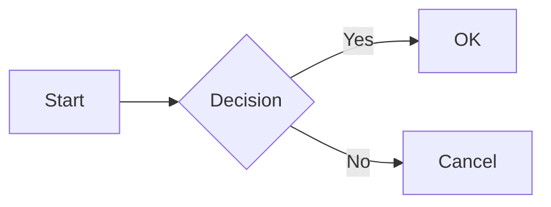

# MarkNote User Guide

Welcome to MarkNote, a lightweight and modern Markdown editor built with JavaFX. This guide will help you get started and make the most of MarkNote's features.

## Table of Contents

1. [Introduction](#introduction)
2. [Getting Started](#getting-started)
3. [Main Interface](#main-interface)
4. [Working with Documents](#working-with-documents)
5. [Search & Replace in Editor](#search--replace-in-editor)
6. [Front Matter Panel](#front-matter-panel)
7. [Project Explorer](#project-explorer)
8. [Search & Indexing](#search--indexing)
9. [Tag Cloud](#tag-cloud)
10. [Network Diagram](#network-diagram)
11. [Status Bar](#status-bar)
12. [Live Preview](#live-preview)
13. [Splash Screen & About](#splash-screen--about)
14. [Themes](#themes)
15. [Options & Settings](#options--settings)
16. [Keyboard Shortcuts](#keyboard-shortcuts)
17. [Troubleshooting](#troubleshooting)

---

## Introduction

MarkNote is a cross-platform Markdown editor designed for writers, developers, and anyone who works with Markdown documents. It provides a distraction-free writing environment with real-time preview, project management, and customizable themes.

### Key Features

- **Markdown Editing** - Full-featured editor with syntax highlighting (headings, bold, italic, strikethrough, code, blockquotes, lists, links, images, horizontal rules)
- **Live Preview** - Real-time HTML rendering as you type
- **Syntax Highlighting** - Code blocks with automatic language detection and theme-coordinated coloring
- **Code Block Copy Button** - One-click copy for code blocks in preview
- **Markdown Tables** - Full GFM table support with styled rendering
- **PlantUML Diagrams** - Render PlantUML diagrams directly in the preview; switch between the **online PlantUML server** (default) or a **local `plantuml.jar`** configured in Options → Tools; local rendering is asynchronous (per-block background threads) and shows a ⚙ spinning gear icon in the status bar during generation
- **Mermaid Diagrams** - Render Mermaid flowcharts, sequences, and more in the preview (theme auto-matches app theme)
- **Math Equations** - LaTeX/MathML support via KaTeX (`$...$` inline, `$$...$$` block)
- **Front Matter Panel** - Collapsible panel above the editor showing and editing YAML front matter metadata, with UUID-based document linking via drag & drop
- **Project Explorer** - Browse and manage your project files, with front matter titles displayed for `.md` files
- **Project Indexing** - Automatic incremental indexing of Markdown files by front matter and filenames
- **Search** - Instant full-text search across indexed documents with live results popup (up to 20 results)
- **Search & Replace in Editor** - In-editor overlay bar (`Ctrl+F` / `Ctrl+H`) with Regex, Full Word, and Match Case toggles, occurrence navigation and bulk replace
- **Tag Cloud** - Visual tag cloud showing tag frequency; click to search
- **Network Diagram** - Interactive force-directed graph of document links and shared tags, with tooltips and current document highlighting
- **Status Bar** - Document info, statistics, and indexing progress at the bottom of the window
- **Multi-document Tabs** - Work on multiple files simultaneously, with drag-to-reorder tabs
- **Theme Support** - Built-in themes with custom theme creation and a full CSS theme editor
- **Splash Screen** - Themed splash screen at startup (configurable)
- **Image Preview** - Quick preview for images with zoom/pan and format/size info overlay
- **Recent Projects** - Quick access to your recent work (files and projects, with Clear History)
- **Drag & Drop** - Drop files into the editor to insert Markdown links or images
- **Multi-language Support** - Available in 5 languages

---

## Getting Started

### First Launch

When you first launch MarkNote, you'll see the **Splash Screen** displaying the application name, version, author, and copyright. Click anywhere or wait a few seconds to dismiss it.

Then you'll be greeted with the **Welcome page**:


The Welcome page shows:
- A list of your recent projects (if any)
- Quick access buttons to open projects

### Opening a Project

1. Click **File → Open project...** in the menu
2. Navigate to your project folder
3. Click **Open**

Your project files will appear in the Project Explorer panel.

### Creating a New Document

1. Click **File → New doc** or press `Ctrl+N`
2. A new untitled document tab will open
3. Start writing your Markdown content

---

## Main Interface

MarkNote's interface is divided into three main areas:


### 1. Project Explorer, Tag Cloud & Network Diagram (Left Panel)

The left panel contains three sub-panels arranged vertically in a resizable split:

- **Project Explorer** (top) - Displays your project's file structure in a tree view. Navigate through folders, double-click files to open them, and right-click for context menu options.
- **Tag Cloud** (middle) - Shows all tags found in your project's Markdown front matter, with font size proportional to frequency. Click a tag to search for it.
- **Network Diagram** (bottom) - An interactive force-directed graph showing the relationships between documents (via links) and shared tags. See [Network Diagram](#network-diagram) for details.

### 2. Search Box (Top Bar)

Located to the right of the menu bar, the search box lets you instantly search across all indexed documents. Results appear in a popup as you type.

### 2b. Edit Menu

The **Edit** menu provides in-document text operations:

| Item | Shortcut | Description |
|------|----------|-------------|
| **Search...** | `Ctrl+F` | Open the Search bar overlay (search field + options) |
| **Search and Replace...** | `Ctrl+H` | Open the Search & Replace overlay (both fields) |

### 3. Editor (Center Panel)

The main editing area where you write your Markdown. Features include:
- Syntax highlighting for Markdown elements (headings, bold, italic, strikethrough, code, blockquotes, lists, links, images, horizontal rules)
- Tab-based interface for multiple documents
- Drag-to-reorder tabs within the tab bar
- Undo/Redo support
- Line numbers (optional)
- Tab names truncated to 15 characters with ellipsis (full name in tooltip)
- Modified documents prefixed with `*` in the tab title

### 3a. Front Matter Panel (Above Editor)

Above the editor text area, a **collapsible Front Matter panel** displays and lets you edit the YAML front matter of the current document. See [Front Matter Panel](#front-matter-panel) for details.


### 4. Preview Panel (Right Panel)

Shows the rendered HTML output of your Markdown in real-time. Features:
- Navigation buttons (back/forward through history)
- Refresh button
- Clickable links that navigate within your project

### 5. Status Bar (Bottom)

A thin bar at the bottom of the window showing:
- **Document name** and **cursor position** (line:column) on the left
- **Statistics** (document count, line count, word count) in the center
- **PlantUML local-jar indicator** (right of center, visible only when local PlantUML mode is active):
  - **⚙ spinning gear** — animated during diagram rendering via the local jar
  - **● PlantUML: local jar** — static badge confirming local mode is on
- **Indexing progress bar** on the right (visible only during indexing)

### Toggling Panels

You can show or hide panels using the **View** menu or by clicking the **×** close button on each panel header:


| Shortcut | Action |
|----------|--------|
| **View → Project explorer** (`Ctrl+E`) | Toggle the left Project Explorer |
| **View → Preview panel** (`Ctrl+P`) | Toggle the right Preview pane |
| **View → Tag Cloud** (`Ctrl+T`) | Toggle the Tag Cloud sub-panel |
| **View → Network Diagram** (`Ctrl+L`) | Toggle the Network Diagram sub-panel |
| **View → Show Welcome** | Open the Welcome tab |

Each panel can also be closed by clicking the **×** button in its header. Re-opening it from the View menu restores it to the layout.

---

## Working with Documents

### Creating Documents


**From the menu:**
- **File → New doc** (`Ctrl+N`) - Creates a new untitled document

**From Project Explorer:**
- Right-click on a folder → **New file**
- Enter a filename (include .md extension)

### Opening Documents

**From the menu:**
- **File → Open file...** (`Ctrl+O`) - Opens a file dialog with extension filters:
  - **Markdown** (`*.md`, `*.markdown`)
  - **Text** (`*.txt`)
  - **All files** (`*.*`)
- **File → Open project...** - Opens a directory chooser to select a project folder
- **File → Recent** - Shows recently opened files and projects

**From Project Explorer:**
- Double-click any Markdown file to open it in a new tab

### Recent Files & Projects

The **File → Recent** submenu is organized into two sections:

- **Files** — recently opened files, displayed as `name (parent directory)`
- **Projects** — recently opened project directories
- **Clear History** — clears all recent entries

If a recent file or directory no longer exists on disk, an error dialog is shown and the entry is automatically removed.

### Saving Documents

- **File → Save** (`Ctrl+S`) - Save the current document
- **File → Save as...** (`Ctrl+Shift+S`) - Save with a new name

When you try to close a modified document without saving, MarkNote will prompt you to save your changes.

### Working with Tabs

- Click on a tab to switch to that document
- Click the **×** button on a tab to close it
- Press `Ctrl+W` to close the active tab
- **Drag tabs** to reorder them within the tab bar
- Modified documents show a **\*** prefix in the tab title
- Tab names longer than 15 characters are truncated with an ellipsis (`…`); hover for the full name

### Drag & Drop into the Editor

You can drag files from the Project Explorer directly into the editor to insert Markdown links:


- **Image files** (`.png`, `.jpg`, `.gif`, `.svg`) → inserts ``
- **Markdown files** (`.md`) → inserts `[front matter title](relative/path)` (uses the front matter title if available, otherwise the filename)

The link is inserted at the exact drop position in the text.

---

## Search & Replace in Editor

MarkNote includes a **Search & Replace overlay bar** that floats over the editor without interrupting your layout. It appears just below the Front Matter panel and only takes up the space it needs.

### Opening the Bar

| Method | Result |
|--------|--------|
| `Ctrl+F` or **Edit → Search...** | Opens the bar with the **search field only** |
| `Ctrl+H` or **Edit → Search and Replace...** | Opens the bar with **both search and replace fields** |
| `Escape` or **✕ button** | Closes the bar and removes all highlights |

### Search Field & Options

The search row contains:

| Control | Description |
|---------|-------------|
| **Search field** | Type your query here; results are highlighted as you type |
| `.*` toggle | Enable **Regular Expression** mode |
| `\b` toggle | Enable **Full Word** matching |
| `Aa` toggle | Enable **Match Case** (case-sensitive search) |
| `▲` button | Navigate to the **previous** occurrence (`Shift+Enter` also works) |
| `▼` button | Navigate to the **next** occurrence (`Enter` also works) |
| **Counter** | Shows the current position and total count (e.g., `2 / 7`) or `No results` |
| `✕` button | Close the bar |

### Replace Field

Visible only when opened via `Ctrl+H` or **Edit → Search and Replace...**:

| Control | Description |
|---------|-------------|
| **Replace field** | The replacement text (plain text, no regex syntax required) |
| **Replace** button | Replace the **currently highlighted** occurrence and move to the next |
| **Replace all** button | Replace **all** occurrences at once |

### Occurrence Highlighting

- All occurrences are highlighted in **yellow** (`search-highlight`)
- The **currently selected** occurrence is highlighted in **orange** (`search-highlight-current`) and the editor scrolls to it
- When the bar is closed, all highlights are removed and normal syntax highlighting is restored

### Regex Mode

When the `.*` toggle is active:
- The query is interpreted as a Java regular expression
- If the pattern is invalid, the search field turns **red** and a `⚠` warning is shown
- Capture groups can be used in the Replace field (e.g., `$1`)

---

## Front Matter Panel

The Front Matter panel is a **collapsible pane** located above the editor text area. It provides a visual interface for editing YAML front matter metadata without manually writing YAML.


### Supported Fields

| Field | Description |
|-------|-------------|
| **Title** | Document title |
| **Tags** | Comma-separated tags for categorization |
| **Authors** | Document author(s) |
| **Summary** | Brief description of the document |
| **UUID** | Unique identifier (auto-generated if absent) |
| **Created At** | Creation date (`YYYY-MM-DD` or `YYYY-MM-DD HH:mm`, auto-set for new documents) |
| **Draft** | Checkbox indicating if the document is a draft |
| **Custom fields** | Any extra YAML keys are preserved and displayed in *italics* |

### Auto-Generated Fields

- **UUID**: When you open a Markdown file with front matter but no UUID, one is automatically generated and added.
- **Created At**: New documents automatically get today's date.

### Document Linking via Drag & Drop

You can create **UUID-based links** between documents by dragging `.md` files onto the Front Matter panel:


1. Drag a `.md` file from the Project Explorer onto the Front Matter panel
2. A blue dashed border appears as visual feedback during drag-over
3. The dropped file's UUID is extracted (or auto-generated if the file doesn't have one)
4. The link appears in the collapsible **"Links"** sub-section with a badge showing the count (e.g., "Links (3)")

### Managing Links

- Each link shows as a **clickable hyperlink** displaying the UUID (with a tooltip showing the target document's title)
- Click a link to **open the linked document** in a new tab
- Click the **✕ button** next to a link to remove it
- Links are rendered in the **preview** as styled link badges using the `marknote-link:` protocol

### Expansion Behavior

- When a document has front matter, the panel is **expanded by default**
- For new documents without front matter, the panel is **collapsed**
- You can configure the default expansion in **Help → Options... → Misc. → Front matter expanded by default**

---

## Project Explorer

The Project Explorer helps you manage your project files efficiently.


### Navigating Files

- **Single-click** - Select a file or folder (multi-selection supported)
- **Double-click** - Open a file in the editor
- **Expand/Collapse** - Click the arrow icons to navigate folders

> **Note:** Markdown files display their **front matter title** instead of the filename in the tree. Hover for a tooltip showing `"filename — title"`. Files and folders starting with `.` are hidden.

### File Organization

- **Directories appear first**, followed by files
- Both are sorted **alphabetically** (case-insensitive)
- File/folder **icons** are displayed for visual distinction

### Context Menu

Right-click on files or folders to access:

| Action | Description |
|--------|-------------|
| **New file** | Create a new file in the selected folder |
| **New folder** | Create a new subfolder |
| **Rename...** | Rename the selected item |
| **Delete** | Delete the selected item (with confirmation) |
| **Reset index** | Rebuild the project search index (root folder only) |

### Drag and Drop

- **Move files (internal)** - Drag files/folders within the explorer to reorganize your project. The destination folder highlights in **light blue** (MOVE mode). A confirmation dialog shows the file names being moved.
- **Copy external files** - Drag files from your file manager into MarkNote. The destination folder highlights in **light green** (COPY mode). A confirmation dialog shows the file names being copied.
- **Multi-file selection** - Select multiple files/folders and drag them together.

> **Note:** For 4 or more files, the confirmation dialog shows the count instead of individual names.

### Supported File Types

| Type | Extensions | Action |
|------|------------|--------|
| Markdown | `.md`, `.markdown` | Opens in editor with preview |
| Text | `.txt`, `.text` | Opens in editor |
| Images | `.png`, `.jpg`, `.jpeg`, `.gif`, `.bmp`, `.webp`, `.svg` | Opens in image preview |
| CSS | `.css` | Opens with CSS syntax highlighting |

### Image Preview

When you open an image file, it is displayed in a dedicated **Image Preview tab**:


- **Info banner** at the top shows: file format (uppercase) and dimensions (e.g., `PNG | 800 × 600 px`)
- **Zoom** with the scroll wheel (range: 10% – 1000%, factor 1.1× per step)
- **Zoom level overlay** appears centered (e.g., `"150%"`) and fades out after 2 seconds
- **Pan** the image by dragging when zoomed in
- Supported formats: `png`, `jpg`, `jpeg`, `gif`, `bmp`, `webp`, `svg`

---

## Search & Indexing

MarkNote automatically indexes all Markdown files in your project to enable fast searching.


### How Indexing Works

When you open a project, MarkNote scans all Markdown files and extracts metadata from their YAML front matter:

```yaml
---
title: Getting Started Guide
tags: tutorial, beginner, guide
authors: John Doe
summary: A step-by-step introduction to MarkNote
uuid: 550e8400-e29b-41d4-a716-446655440000
draft: false
---
```

The index is stored as a `.marknote-index.json` file in your project root (hidden from the Project Explorer).

### Incremental Updates

The index is automatically kept up to date:
- **Creating a file** - The new file is immediately indexed
- **Saving a file** - Front matter changes are re-indexed
- **Renaming a file** - The index entry is updated
- **Moving files** - Paths are updated in the index
- **Deleting a file** - The entry is removed from the index
- **Copying files** - New entries are added for the copies

### Using the Search Box

The search box is located in the top-right corner of the menu bar:

1. Click the search field or start typing
2. Results appear instantly in a dropdown popup (up to **20 results**)
3. Each result shows:
   - **Document title** (bold, 13px)
   - **Match context** (gray, 11px — e.g., "Tag: java", "Title: Getting Started")
   - **File path** (italic gray, 10px, relative to the project root)
4. Click a result or press `Enter` (selects first result) to open the document
5. Press `Down Arrow` to navigate the results list
6. Press `Escape` to dismiss the results and clear the field

Search matches against:
- Document title
- Filename
- Tags
- Summary
- Authors
- UUID

### Index Persistence

The index is stored as a `.marknote-index.json` file at the project root. It is **loaded automatically** when you reopen a project, avoiding re-indexing. The index contains: file paths, filenames, UUIDs, titles, authors, tags, summaries, creation dates, draft status, links, and tag counts.

### Rebuilding the Index

If the index becomes out of sync, you can rebuild it:

1. Right-click on the **root folder** in the Project Explorer
2. Select **Rebuild index**
3. The index will be regenerated from scratch

> **Note:** The "Rebuild index" option only appears on the root project folder.

---

## Tag Cloud

The Tag Cloud panel provides a visual overview of all tags used across your project.


### How It Works

The Tag Cloud displays all tags extracted from your documents' YAML front matter (`tags:` field). Each tag is displayed as a clickable label with:

- **Font size proportional to frequency** - Tags used in many documents appear larger (up to 28px), while rare tags appear smaller (down to 11px)
- **Color variation** - Tags are displayed in different colors for visual distinction

### Interacting with Tags

- **Click a tag** to immediately search for all documents tagged with it. The search term is entered in the Search Box and matching results are shown.
- **Hover** over a tag to see it highlighted

### Tag Cloud Location

The Tag Cloud panel appears below the Project Explorer in the left panel. It can be closed using the **×** button in its header.

### Keeping Tags Updated

The Tag Cloud updates automatically whenever the project index changes:
- Opening a project
- Creating, saving, renaming, or deleting documents
- Rebuilding the index

---

## Network Diagram

The Network Diagram panel provides an interactive visualization of the relationships between your documents.


### How It Works

The Network Diagram uses a **force-directed layout** algorithm to arrange your documents as a graph:

- **Document nodes** (📄 icon) represent each Markdown file in your project
- **Tag nodes** (blue circles with `#`) represent shared tags
- **Solid edges** connect documents that reference each other via `links:` in their front matter
- **Dashed edges** connect documents to the tags they share
- **Current document** is highlighted with an **orange border** and cream-colored fill
- **Isolated nodes** (no connections) are automatically hidden from the diagram

The physics simulation runs until the layout stabilizes (~60 frames below velocity threshold), then the view **automatically zooms to fit** all nodes with a 40px margin.

### Navigation & Interaction

| Action | Description |
|--------|-------------|
| **Click a document node** | Open that document in the editor |
| **Click a tag node** | Show a search popup listing all documents with that tag |
| **Click an edge** | Open the nearest connected document node |
| **Drag a node** | Move a node to rearrange the layout (pins during drag, unpins on release) |
| **Middle-click + drag** | Pan the view |
| **Scroll wheel** | Zoom in/out (range: 0.1× – 8.0×, centered on cursor) |
| **Ctrl + Click** | Reset zoom and recenter (zoom-to-fit) |

### Tooltips

- **Document node hover**: shows title (bold), author, and creation date
- **Tag node hover**: shows `#tagname` and the number of connected documents

### Tag Search Popup

When you click a tag node in the diagram, a popup appears showing all documents that contain that tag. Each result displays:
- **Document title** (bold)
- **Match context** (e.g., "tag: java")
- **File path** (relative to the project root)

Click a result to open the document directly. You can also navigate the popup with the keyboard (`Enter` to select, `Escape` to close).

### Front Matter Links

To create links between documents, add a `links:` field in your YAML front matter with **UUID references**:

```yaml
---
title: My Document
tags: java, tutorial
links:
  - 550e8400-e29b-41d4-a716-446655440000
  - 7c9e6679-7425-40de-944b-e07fc1f90ae7
---
```

These links appear as solid lines connecting the two documents in the diagram. You can also create links by **dragging `.md` files onto the Front Matter panel** (see [Front Matter Panel](#front-matter-panel)).

### Keeping the Diagram Updated

The Network Diagram updates automatically whenever:
- A project is opened
- Files are created, saved, renamed, moved, or deleted
- The index is rebuilt

---

## Status Bar

The status bar is displayed at the bottom of the main window and provides at-a-glance information about your current work.


### Sections

| Section | Content |
|---------|----------|
| **Document & Position** | Name of the active document and cursor position (Ln/Col) |
| **Statistics** | Number of indexed documents, lines in the current document, and word count |
| **PlantUML indicator** | Spinning ⚙ gear during local-jar rendering + "● PlantUML: local jar" badge (only visible when local mode is active in Options → Tools) |
| **Indexing Progress** | A progress bar shown while the indexing service is running |

### Background Indexing

When a full index build or rebuild is triggered, the indexing runs in a **background thread** so that your editing is never interrupted. The progress bar shows the indexation progress in real-time. Once complete, the status returns to "Ready".

---

## Live Preview

The Preview panel shows your Markdown rendered as HTML in real-time.

### Navigation

| Button | Description |
|--------|-------------|
| **◀** | Go back to previous state |
| **▶** | Go forward |
| **↻** | Refresh the preview |
| **×** | Close the preview panel |

### Clicking Links

When you click a Markdown link in the preview:
- **Local Markdown files** (`.md`, `.markdown`, relative paths) - Open in a new MarkNote tab
- **UUID-based links** (`marknote-link:uuid`) - Resolved by searching all project files for the matching UUID, then opened in a tab
- **External URLs** - Open in your default browser

### Collapsible Front Matter Block

When a document has YAML front matter, the preview renders it as a **styled, collapsible `<details>/<summary>` block** at the top:


- **Title** displayed as a heading
- **Draft badge** ("✎ Draft" in red) if `draft: true`
- **UUID** in monospace
- **Author** and **Date**
- **Tags** as styled color badges
- **Summary** in italics
- **Linked documents** as clickable link badges (resolved from UUID to title)

### Supported Markdown Features

MarkNote supports standard Markdown syntax plus extensions:

```markdown
# Headings (H1 through H6)

**Bold text** and *italic text*

`Inline code` and code blocks

- Bullet lists
- With multiple items

1. Numbered lists
2. Work too

[Links](https://example.com)


> Blockquotes

---
Horizontal rules
---

| Tables | Are | Supported |
|--------|-----|-----------|
| Data   | Goes| Here      |
```

### Code Syntax Highlighting

Fenced code blocks are automatically highlighted with language detection:

````markdown
```java
public class Hello {
    public static void main(String[] args) {
        System.out.println("Hello, world!");
    }
}
```
````

The syntax highlighting theme automatically adapts to your chosen application theme:

| App Theme | highlight.js Style | Code Background | Code Foreground |
|---|---|---|---|
| Light | `github` | `#f6f8fa` | `#24292e` |
| Dark | `github-dark` | `#282c34` | `#e6e6e6` |
| Solarized Light | `stackoverflow-light` | `#fdf6e3` | `#657b83` |
| Solarized Dark | `stackoverflow-dark` | `#002b36` | `#93a1a1` |
| High Contrast | `a11y-dark` | `#1a1a1a` | `#f8f8f2` |

Custom themes are detected via a **"Based on:" comment** in the CSS header, with a heuristic fallback (dark background → dark syntax theme).

### Code Block Copy Button

Every code block in the preview displays a **"Copy" button** on hover (top-right corner). Clicking it copies the code to the clipboard, and the button briefly shows **"✓ Copied"** with a green background for 1.5 seconds.

### PlantUML Diagrams

Embed PlantUML diagrams directly in your Markdown using fenced code blocks:

````markdown

```plantuml
@startuml
Alice -> Bob: Hello
Bob --> Alice: Hi!
@enduml
```
````

> **Note:** If a PlantUML code block doesn't start with `@start`, it is **automatically wrapped** with `@startuml` / `@enduml`.

#### Rendering Mode

By default, diagrams are rendered by the **official PlantUML online server** (`https://www.plantuml.com/plantuml/svg/`). If an internet connection is unavailable or you prefer privacy, you can configure a **local `plantuml.jar`** instead.

| Mode | How it works | Setup needed |
|------|-------------|---------------|
| **Online server** (default) | Encodes the diagram source and fetches an SVG from plantuml.com | None |
| **Local jar** | Runs `java -jar plantuml.jar -pipe -tsvg` in a background process per diagram block; injects the SVG directly into the page when ready | Configure in **Options → Tools** |

When local rendering is active:
- Each diagram is replaced temporarily by a *"⏳ Rendering diagram…"* placeholder
- Background threads render each block independently
- The **⚙ spinning gear** icon in the status bar is visible during rendering
- On completion the placeholders are replaced inline with the SVG (no page reload)
- If the local jar fails, the diagram falls back silently to the online server

See [Options → Tools Tab](#tools-tab) to configure the local jar.

### Mermaid Diagrams

Mermaid diagrams are also supported:

````markdown

```mermaid
graph LR
    A[Start] --> B{Decision}
    B -->|Yes| C[OK]
    B -->|No| D[Cancel]
```
````

Mermaid diagrams are rendered client-side in the preview panel. The Mermaid theme **automatically matches** your application theme: dark themes use the Mermaid `"dark"` theme, while light themes use `"default"`.

### Math Equations (KaTeX)

MarkNote supports LaTeX math notation via KaTeX:

- **Inline math:** `$E = mc^2$` renders as an inline equation
- **Block math:**

```markdown
$$
\int_{-\infty}^{\infty} e^{-x^2} dx = \sqrt{\pi}
$$
```

### Image Sizing

MarkNote extends the standard Markdown image syntax to allow specifying image dimensions using `=WIDTHxHEIGHT` at the end of the image declaration:

```markdown

```

This renders the image with `width="100"` and `height="20"` attributes.

You can also specify only width or only height:

| Syntax | Result |
|--------|--------|
| `` | Width 300px, Height 200px |
| `` | Width 400px, height auto |
| `` | Width auto, height 150px |

> **Note:** Without the `=WxH` suffix, images behave as standard Markdown images and scale automatically to fit the preview.

---

## Splash Screen & About

### Splash Screen

When MarkNote starts, a themed splash screen is displayed showing:
- The **application logo** (centered at the top)
- The application name and version
- Author and contact information
- Copyright notice

Click anywhere on the splash screen to dismiss it and continue to the main window.

The splash screen follows the current application theme (Light, Dark, Solarized, etc.). You can disable it in **Help → Options... → Misc. → Show splash screen on startup**.

### About Dialog

Access the same information at any time via **Help → About**. The About dialog displays the same content as the splash screen in a modal window with a **Close** button.

---

## Themes

MarkNote comes with several built-in themes and allows you to create custom themes.


### Built-in Themes

| Theme | Description |
|-------|-------------|
| **Light** | Clean white background (default) |
| **Dark** | Dark background, easy on the eyes |
| **Solarized Light** | Warm, low-contrast light theme |
| **Solarized Dark** | Popular dark theme with warm colors |
| **High Contrast** | Maximum contrast for accessibility |

### Changing Themes

1. Go to **Help → Options...**
2. Select the **Themes** tab
3. Click on your desired theme
4. Click **OK** to apply

### Creating Custom Themes

1. In the Themes options tab, click **Create theme...**
2. Enter a name for your theme
3. A copy of the currently selected theme is created (name sanitized to lowercase alphanumeric + hyphens)
4. The CSS file includes a header comment: `/* Custom Theme: name \n * Based on: basedOn */`
5. The **CSS theme editor** opens automatically (closes the options dialog)
6. Modify the CSS to customize colors and styles
7. Save the file (`Ctrl+S`) — if editing the current theme, the app theme **refreshes automatically**

Custom themes are stored in `~/.marknote/themes/`.

### Deleting Custom Themes

- In the Themes tab, select a custom theme and click **Delete Theme**
- Built-in themes cannot be deleted
- A confirmation dialog is shown before deletion

### Theme List Formatting

In the Themes options tab:
- **Italic** names = built-in themes
- **Bold** names = custom themes
- **Double-click** a custom theme to open it in the CSS editor

### CSS Theme Editor

The CSS theme editor provides a full editing experience with **syntax highlighting** for:
- Comments, strings, hex colors
- Numbers (with CSS units)
- Pseudo-classes, selectors, properties
- Braces and punctuation

Modification indicator (**\*** prefix) and save/close confirmation work the same as document tabs.

### Theme CSS Structure

```css
/* Main editor colors */
.code-area {
    -fx-background-color: #1e1e1e;
    -fx-text-fill: #abb2bf;
}

/* Markdown syntax highlighting */
.heading { -fx-fill: #c678dd; }
.bold { -fx-fill: #e06c75; }
.italic { -fx-fill: #98c379; }
.code { -fx-fill: #61afef; }
```

---

## Options & Settings

Access settings via **Help → Options...** or by pressing the shortcut shown in the menu.

### Misc. Tab

| Option | Description |
|--------|-------------|
| **Number of recent files/projects** | How many items to show in Recent menus (1-50) |
| **Create document on startup** | Automatically create a new document when starting |
| **Reopen last project on startup** | Remember and reopen your last project (shows a confirmation dialog with the project name) |
| **Show Welcome page on startup** | Display the Welcome tab when starting |
| **Show splash screen on startup** | Display the splash screen when starting (enabled by default) |
| **Front matter expanded by default** | Whether the Front Matter panel is expanded when opening documents (default: true) |
| **Language** | Choose your preferred interface language (`system` follows OS locale) |

> **Note:** Changing the language **saves the configuration immediately** and **restarts the application**.

### Themes Tab

- View and select from available themes (italic = built-in, bold = custom)
- Create new custom themes based on existing ones
- Delete custom themes (built-in themes cannot be deleted)
- Double-click a custom theme to open it in the CSS editor

### Tools Tab

The **Tools** tab lets you configure external tools used by MarkNote.

#### PlantUML Local Jar

| Option | Description |
|--------|-------------|
| **Use local PlantUML jar** | Checkbox — when checked, MarkNote uses your local `plantuml.jar` instead of the online server for rendering diagrams in the preview |
| **PlantUML jar path** | Full path to your `plantuml.jar` file. Use the **Browse…** button to open a file selector filtered to `*.jar` |

**Steps to configure:**

1. Download `plantuml.jar` from [https://plantuml.com/download](https://plantuml.com/download)
2. Open **Help → Options…**
3. Select the **Tools** tab
4. Click **Browse…** and select your `plantuml.jar`
5. Check **Use local PlantUML jar**
6. Click **OK**

Once enabled:
- The status bar shows **● PlantUML: local jar** on the right side
- A **⚙ spinning gear** appears next to it while diagrams are being rendered
- The preview refreshes automatically to apply the new setting

> **Note:** Java must be on your system `PATH` since the jar is executed as `java -jar plantuml.jar`.

### Language Settings

MarkNote supports the following languages:
- 🇫🇷 Français (French)
- 🇬🇧 English
- 🇩🇪 Deutsch (German)
- 🇪🇸 Español (Spanish)
- 🇮🇹 Italiano (Italian)

To change the language:
1. Go to **Help → Options...**
2. In the **Misc.** tab, select your language
3. The application will restart to apply the change

---

## Keyboard Shortcuts


### File Operations

| Shortcut | Action |
|----------|--------|
| `Ctrl+N` | New document |
| `Ctrl+O` | Open file |
| `Ctrl+S` | Save |
| `Ctrl+Shift+S` | Save as |
| `Ctrl+W` | Close current tab |
| `Ctrl+Q` | Quit application |

### Editing

| Shortcut | Action |
|----------|--------|
| `Ctrl+Z` | Undo |
| `Ctrl+Y` | Redo |
| `Ctrl+X` | Cut |
| `Ctrl+C` | Copy |
| `Ctrl+V` | Paste |
| `Ctrl+A` | Select all |
| `Ctrl+F` | Open Search bar (search only) |
| `Ctrl+H` | Open Search & Replace bar |

### Navigation

| Shortcut | Action |
|----------|--------|
| `Ctrl+Tab` | Next tab |
| `Ctrl+Shift+Tab` | Previous tab |
| `F5` | Refresh preview |

### View

| Shortcut | Action |
|----------|--------|
| `Ctrl+E` | Toggle Project Explorer |
| `Ctrl+P` | Toggle Preview panel |
| `Ctrl+T` | Toggle Tag Cloud |
| `Ctrl+L` | Toggle Network Diagram |

> **Note:** On macOS, use `Cmd` instead of `Ctrl`.

---

## Troubleshooting

### Common Issues

#### The preview is not updating

1. Click the **Refresh** button (↻) in the preview panel
2. Check that the Preview panel is visible (View → Preview panel)
3. Make sure you're editing a Markdown file (.md)

#### Files are not showing in Project Explorer

1. Make sure you've opened a project (File → Open project...)
2. Check that the Project Explorer is visible (View → Project explorer)
3. Try refreshing by closing and reopening the project

#### Theme changes are not applied

1. Make sure to save your custom theme CSS file
2. If editing the current theme, close and reopen options
3. Restart MarkNote if changes still don't appear

#### Application language didn't change

1. The application needs to restart after changing language
2. Try closing and reopening MarkNote manually
3. Check the language setting in Options → Misc.

### Getting Help

If you encounter issues not covered here:

1. Check the [GitHub repository](https://github.com/mcgivrer/marknote) for known issues
2. Submit a bug report with details about your system and the problem
3. Contact the author at contact.snapgames@gmail.com

---

## About MarkNote

**Version:** 0.0.6
**Author:** Frédéric Delorme  
**Copyright:** © SnapGames 2026  
**License:** MIT  
**Repository:** https://github.com/mcgivrer/marknote

---

*This documentation is part of the MarkNote project. Last updated: February 2026.*
